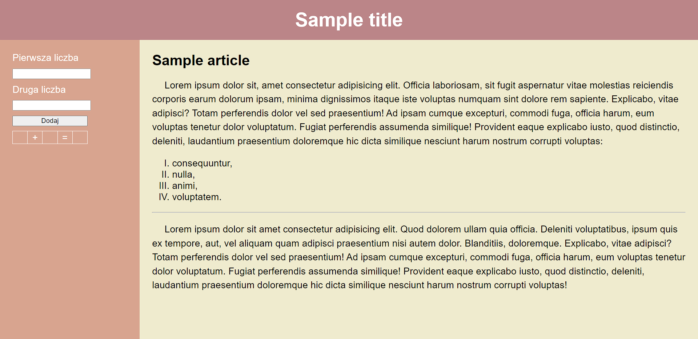

# Projekt witryny

## Zawartość
* Witryna napisana w języku *HTML5*, w pliku o nazwie **index** z odpowiednim rozszerzeniem.
* Zastosowany właściwy standard kodowania polskich znaków.
* Zadeklarowany język zawartości witryny - **polski**.
* Tytuł strony widoczny na karcie przeglądarki - **Przykładowa strona**.
* Prawidłowo połączony zewnętrzny arkusz stylów.
* Witryna jest podzielona na semantyczne elementy blokowe.
* U góry witryny znajduje się belka górna zawierająca nagłówek pierwszego stopnia.
* Poniżej leży część główna, a w niej formularz oraz artykuł.
* W skład formularza wchodzą dwa pola wejściowe typu liczbowego poprzedzone poprawnie połączonymi etykietami, przycisk i jednowierszowa tabela posiadająca pięć komórek. Wewnątrz drugiej komórki znajduje się znak `+`, a wewnątrz czwartej `=`.
* W artykule jest nagłówek drugiego rzędu, akapit, czteroelementowa lista uporządkowana, pozioma linia oraz kolejny akapit.

## Wygląd

* Strona powinna w jak największym stopniu przypominać załączoną grafikę.
* Style zdefiniowane w oddzielnym pliku CSS o nazwie **main** i odpowiednim rozszerzeniu.
* Znacznik `body` i nagłówek pierwszego i drugiego poziomu mają wyzerowany margines zewnętrzny.
* Znacznik `body`:
    * Krój czcionki: **'Trbuchet MS', sans-serif**.
    * Rozmiar czcionki: *"większy"*.
* Belka górna:
    * Wysokość: *80 pikseli*,
    * Kolor tła: *BB858816*,
    * Wysokość linii: *80 pikseli*,
    * Wyrównanie tekstu do środka,
    * Biały kolor czcionki.
* Część główna posiada wysokość równą *600px*.
* Formularz:
    * Szerokość: *25 procent*,
    * Margines wewnętrzny: *25 pikseli*,
    * Kolor tła: *D8A48F16*,
    * Biały kolor czcionki,
* Formularz, artykuł:
    * Wysokość: *100 procent*,
    * zmiana sposobu obliczania wysokości i szerokości na uwzględniający obramowania i marginesy wewnętrzne - `box-sizing` o odpowiedniej wartości.
* Pole wejściowe, etykieta, przycisk, tabela - szerokość: *150 pikseli*.
* Pole wejściowe, etykieta, przycisk:
    * Blokowy sposób wyświetlania - `display`,
    * dolny margines zewnętrzny: *10 pikseli*.
* Przycisk, tabela - zewnętrzny margines górny: *10 pikseli*.
* Tabela - brak odstępu pomiędzy komórkami - `border-collapse`.
* Komórka:
    * Obramowanie: grubość - *1px*, typ - *ciągłe*.
    * Wyrównanie tekstu do środka,
    * Szerokość: *20 pikseli*.
* Artykuł:
    * Szerokość: *80 procent*,
    * Margines wewnętrzny: *20 pikseli*,
    * Kolor tła: *EFEBCE16*.
* Akapit:
    * Wcięcie tekstu: *25 pikseli*,
    * Wysokość linii: *28 pikseli*.
* Lista - styl punktorów: *wielkie rzymskie liczby*.

---

Style pozwalające na odpowiednie ułożenie danych elementów należy dobrać samodzielnie - `float`.

### Oczekiwany wygląd witryny

## Działanie

Po wciśnięciu przycisku (zdarzenie `click`) skrypt ma pobrać wartości wprowadzone przez użytkownika do pól wejściowych, przekonwertować je na liczby i dodać je do siebie. Na koniec pierwsza liczba ma zostać wpisana (`innerText`) w pierwszą komórkę tabeli leżącą poniżej przycisku, druga liczba w trzecią komórkę, a wynik w ostatnią.
