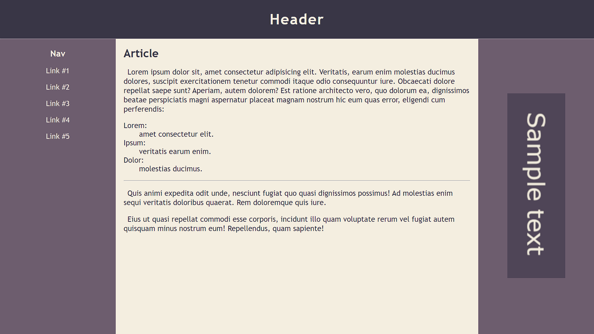

# Zawartość

* Witryna napisana w języku HTML5, w pliku o nazwie **"index"** z odpowiednim rozszerzeniem.

* Zastosowany właściwy *standard kodowania* polskich znaków.

* Zadeklarowany język zawartości witryny – **polski**.

* Tytuł strony widoczny na karcie przeglądarki – **"Sample title"**.

* Witryna jest podzielona na *semantyczne elementy blokowe*.

* U góry witryny znajduje się `belka` zawierająca `nagłówek pierwszego stopnia`.

* Poniżej leży `część główna`, a w niej `nawigacja`, `artykuł` oraz `element poboczny`.

* W skład nawigacji wchodzi `nagłówek trzeciego rzędu` oraz pięć `hiperłącz`.

* W artykule znajduje się `nagłówek drugiego stopnia`, `akapit`, trzyelementowa `lista opisowa`, `pozioma linia` oraz kolejne dwa `akapity`.

* Element poboczny zawiera znacznik `figure` z grafiką - plik `banner.png`.

&nbsp;
# Wygląd

* Style zdefiniowane w oddzielnym pliku CSS o nazwie **„main”** i odpowiednim rozszerzeniem.

* Zewnętrzny arkusz stylów prawidłowo połączony ze stroną.

* Znacznik `body` oraz `nagłówki pierwszego`, `drugiego` i `trzeciego stopnia` mają wyzerowany **margines zewnętrzny**.

## Body

* Minimalna wysokość: 100vh,

* Sposób wyświetlania: `flex`,

* Kierunek wyświetlania (`flex-direction`): kolumna,

* Krój czcionki: *Trebuchet MS, sans-serif*,

* Rozmiar czcionki: *"większy"*.

## Belka górna

* Wysokość: *100* pikseli,

* Wysokość linii: *100* pikseli,

* Wyrównanie tekstu do środka,

* *2* piksele odstępu między literami,

* Ciągłę obramowanie **dolne** o grubości *1* piksela,

* Kolor tła: *39364616*,

* Kolor czcionki: *F4EEE016*.

## Część główna

* Sposób wyświetlania: `flex`,

* Atrybut `flex-grow` ustawiony na wartość *1*.

## Panele boczne - nawigacja i element poboczny

* Sposób wyświetlania: `flex`,

* Kierunek wyświetlania: kolumna,

* Szerokość: *20* procent,

* Kolor tła: *6D5D6E16*,

* Kolor czcionki: *F4EEE016*.

## Nawigacja

* Ciągłe obramowanie **prawe** o grubości *1* piksela.

## Nagłówek trzeciego stopnia

* Wyrównanie tekstu do środka,

* **Zewnętrzny** margines górny: *25* pikseli,

* **Zewnętrzny** margines dolny: *10* pikseli.

## Odnośnik

* Sposób wyświetlania: blok,

* Pionowy margines **zewnętrzny**: *10* pikseli,

* Automatyczny **poziomy** margines **zewnętrzny**,

* Brak dekoracji tekstu,

* Kolor czcionki: *F4EEE016*,

* Po najechaniu kursorem rozmiar czcionki powinien zmienić się na *"bardzo duży"*.

## Artykuł

* Szerokość: *60* procent,

* **Wewnętrzny** margines: *20* pikseli,

* Kolor tła: *F4EEE016*,

* Kolor czcionki: *39364616*.

## Akapit

* Wcięcie tekstu: *10* pikseli,

* Wysokość linii: *24* piksele.

## Element poboczny

* Ciągłe obramowanie **lewe** o grubości *1* piksela.

## Znacznik `figure`

* Automatyczny margines **zewnętrzny**,

* Szerokość: *50* procent.

## Grafika

* Szerokość: *100* procent.

---

Strona powinna w jak największym stopniu przypominać załączoną grafikę:

