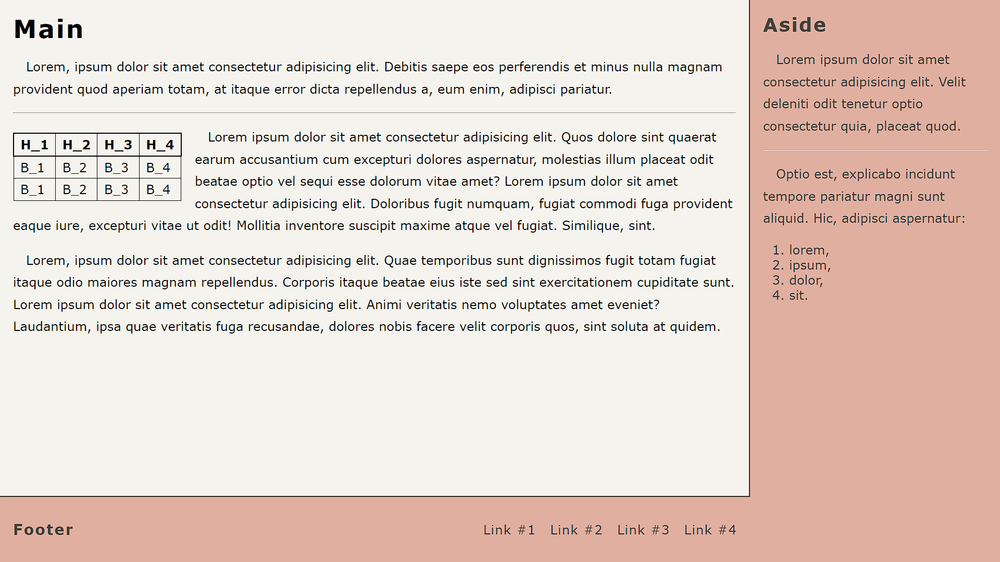

# Zawartość

* Witryna napisana w języku HTML5, w pliku o nazwie **"index"** z odpowiednim rozszerzeniem.

* Zastosowany właściwy *standard kodowania* polskich znaków.

* Zadeklarowany język zawartości witryny – **polski**.

* Tytuł strony widoczny na karcie przeglądarki – **"Page"**.

* Witryna jest podzielona na *semantyczne elementy blokowe*.

&nbsp;
# Wygląd

* Style zdefiniowane w oddzielnym pliku CSS o nazwie **"main"** i odpowiednim rozszerzeniem.

* Zewnętrzny arkusz stylów prawidłowo połączony ze stroną.

* Pozycjonowanie elementów zrealizowane przy pomocy `flex`.

---

Strona powinna w jak największym stopniu przypominać załączoną grafikę:

