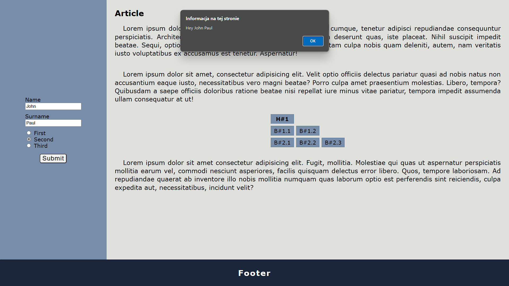

# Projekt witryny

## Zawartość
* Witryna napisana w języku *HTML5*, w pliku o nazwie **index** z odpowiednim rozszerzeniem.
* Zadeklarowany język zawartości witryny - **angielski**.
* Tytuł strony widoczny na karcie przeglądarki - **Sample page**.
* Prawidłowo połączony zewnętrzny arkusz stylów.
* Witryna jest podzielona na semantyczne elementy blokowe.
* Główna część witryny jest podzielona na formularz oraz artykuł.
* W formularzu znajdują się dwa pola wejściowe oraz trzy pola typu `radio`, wszystkie posiadające poprawnie połączone etykiety, oraz przycisk.
* Artykuł zawiera nagłówek pierwszego stopnia, dwa akapity, tabelę oraz kolejny akapit.
* Tabela składa się odpowiednio z jednej, dwóch oraz trzech komórek w kolejnych wierszach. Przy czym pierwsza komórka pierwszego wiersza jest nagłówkowa.
* Na samym dole witryny znajduje się stopka z nagłówkiem drugiego stopnia.

## Wygląd

* Strona powinna w jak największym stopniu przypominać załączoną grafikę.
* Style zdefiniowane w oddzielnym pliku CSS o nazwie **main** i odpowiednim rozszerzeniu.
* Na początku witryny, w selektorze `:root`, zadeklarowane są trzy zmienne zawierające kolory witryny:
    * `form-color`: 778da916,
    * `article-color`: e0e1dd16,
    * `footer-color`: 1b263b16.
* Znacznik `body`:
    * Krój czcionki: **Verdana**,
    * Rozmiar czcionki: *"większy"*.
* Znacznik `body` oraz nagłówek pierwszego i drugiego poziomu mają wyzerowany margines zewnętrzny.
* Artykuł:
    * Szerokość: *80 procent*,
    * Margines wewnętrzny: *25 pikseli*.
* Akapit:
    * Wyrównanie tekstu: wyjustowany,
    * Wcięcie tekstu: *25 pikseli*,
    * Margines wewnętrzny: *25 pikseli*,
    * Rozmiar czcionki: *"większy"*.
* Tabela - wertykalny margines zewnętrzny: *10 pikseli*.
* Komórka:
    * Kolor tła: `form-color`,
    * Wertykalny margines wewnętrzny: *5 pikseli*,
    * Horyzontalny margines wewnętrzny: *10 pikseli*,
    * Obramowanie: grubość - *3 piksele*, typ - *ciągłe*, kolor - `article-color`.
* Formularz:
    * Szerokość: *20 procent*,
    * Margines wewnętrzny: *15 pikseli*,
    * Kolor tła: `form-color`.
* Pola wprowadzania typu tekstowego - dolny margines zewnętrzny: *10 pikseli*.
* Etykieta - typ wyświetlania: *blokowy*.
* Przycisk:
    * Górny margines zewnętrzny: *15 pikseli*,
    * Wertykalny margines zewnętrzny: *automatyczny*,
    * Odstęp liter: *1 piksel*,
    * Rozmiar czcionki: *"większy"*,
    * Zaokrąglenie krawędzi: *5 pikseli*.
* Stopka:
    * Wysokość: *80 pikseli*,
    * Kolor tła: `footer-color`,
    * Wysokość linii: *80 pikseli*,
    * Kolor: *biały*.
* Nagłówek drugiego stopnia:
    * Wyrównanie teksu: *wyśrodkowanie*,
    * Odstęp liter: *2 piksele*

---

Style pozwalające na odpowiednie ułożenie danych elementów należy dobrać samodzielnie - `flex`.

### Oczekiwany wygląd witryny

## Działanie

Po wciśnięciu przycisku (zdarzenie `click`) skrypt ma pobrać wartości wprowadzone przez użytkownika do pól wejściowych, a następnie wyświetlić je przy pomocy okna dialogowego (`alert`). W zależności od wybranej przez użytkownika opcji należy wyświetlić odpowiedni komunikat:

1. Hi \<imię> \<nazwisko>!
2. Hey \<imię> \<nazwisko>!
3. Hello \<imię> \<nazwisko>!

&nbsp;

