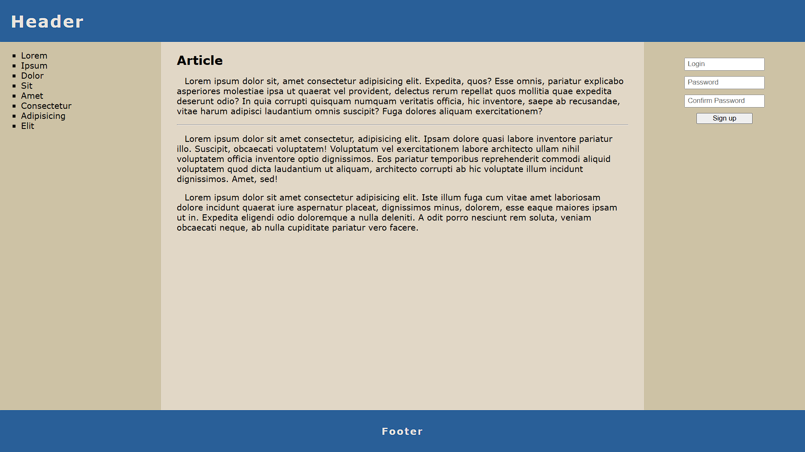

# Projekt witryny

## Zawartość
* Witryna napisana w języku *HTML5*, w pliku o nazwie **index** z odpowiednim rozszerzeniem.
* Zadeklarowany język zawartości witryny - **angielski**.
* Tytuł strony widoczny na karcie przeglądarki - **Sample page**.
* Prawidłowo połączony zewnętrzny arkusz stylów.
* Witryna jest podzielona na semantyczne elementy blokowe.
* Na górze znajduje się *belka górna* zawierająca nagłówek *pierwszego stopnia*.
* *Część główna* witryny podzielona jest na *część poboczną*, *artykuł* oraz *formularz*.
* W skład części pobocznej wchodzi *lista nieuporządkowana* z kilkoma przykładowymi punktami.
* Artykuł zawiera *nagłówek drugiego stopnia*, *akapit*, *poziomą linię* oraz kolejne dwa *akapity*.
* W formularzu znajdują się trzy *pola wprowadzania* i *przycisk*.
* Na dole witryny jest *stopka*, a w niej *nagłówek trzeciego rzędu*.

## Wygląd

* Strona powinna w jak największym stopniu przypominać załączoną grafikę.
* Style zdefiniowane w oddzielnym pliku CSS o nazwie **main** i odpowiednim rozszerzeniu.
* Zastosowane kolory:
  * 295F9816
  * CDC2A516
  * E1D7C616
  * EAE4DD16
* Krój czcionki: **Verdana**.
* Należy zadbać o podstawową responsywność.

---

### Oczekiwany wygląd witryny

## Działanie

Po wciśnięciu przycisku (zdarzenie `click`) skrypt ma pobrać wartości wprowadzone przez użytkownika do pól wejściowych. Należy sprawdzić czy użytkownik wprowadził wszystkie potrzebne dane oraz czy hasła się pokrywają. Na koniec wyświetlić odpowiedni komunikat (`alert`).
