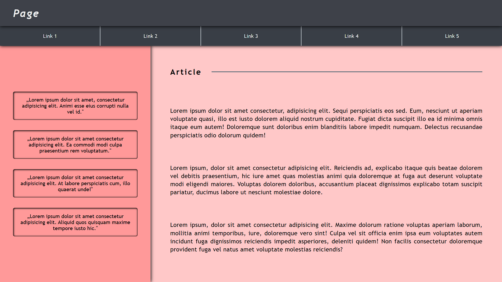
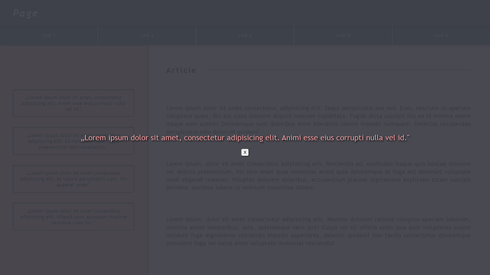

# Projekt witryny

## Zawartość
* Witryna napisana w języku *HTML5*, w pliku o nazwie **index** z odpowiednim rozszerzeniem.
* Zadeklarowany język zawartości witryny - **angielski**.
* Tytuł strony widoczny na karcie przeglądarki - **Page**.
* Prawidłowo połączony zewnętrzny arkusz stylów.
* Witryna jest podzielona na semantyczne elementy blokowe.
* Na górze znajdują się *belka górna*, zawierająca *nagłówek*, wraz z *nawigacją* złożoną z pięciu *odnośników*.
* Główna część witryny jest podzielona na dwie kolumny.
* *Lewy panel* zawiera *bloki cytatów*.
* *Prawy panel* składa się z *nagłówka* i trzech *akapitów*.

## Wygląd

* Strona powinna w jak największym stopniu przypominać załączoną grafikę.
* Style zdefiniowane w oddzielnym pliku CSS o nazwie **index** i odpowiednim rozszerzeniu.
* Zastosowane kolory:
  * 3E414916 - kolor belki górnej
  * 393E4616 - kolor nawigacji
  * FF999916 - kolor lewego panelu
  * FFC8C816 - kolor prawego panelu
  * EEEEEE16 - jasna czcionka
  * 444F5A16 - ciemna czcionka
* Krój czcionki: **Trebuchet MS**.
* Należy zadbać o podstawową responsywność.
* Po najechaniu na link zwiększa się rozmiar jego czcionki, a tło delikatnie się rozjaśnia.

---

### Oczekiwany wygląd witryny

## Działanie

Po naciśnięciu na dany cytat zostaje on wyróżniony na środku witryny. Przycisk umożliwia opuszczenie widoku.

