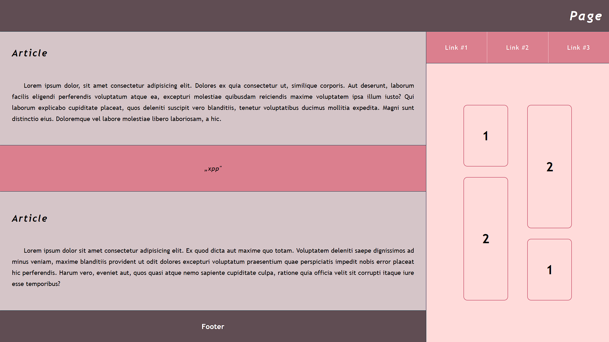

# Projekt witryny

## Zawartość
* Witryna napisana w języku *HTML5*, w pliku o nazwie **index** z odpowiednim rozszerzeniem.
* Zadeklarowany język zawartości witryny - **angielski**.
* Tytuł strony widoczny na karcie przeglądarki - **Page**.
* Prawidłowo połączony zewnętrzny arkusz stylów.
* Witryna jest podzielona na *semantyczne elementy blokowe*.

## Wygląd

* Strona powinna w jak największym stopniu przypominać załączoną grafikę.
* Style zdefiniowane w oddzielnym pliku CSS o nazwie **index** i odpowiednim rozszerzeniu.
* Zastosowane kolory:
  * Kolor nagłówka i stopki: `#604D53`
  * Kolor nawigacji i bloku cytatu: `#DB7F8E`
  * Kolor prawego panelu: `#FFDBDA`
  * Kolor artykułu: `#D5C5C8`
  * Jasny kolor czcionki: `#FDFDFF`
  * Kolor obramowań: `#444F5A`
* Krój czcionki: **Trebuchet MS**.
* Należy zadbać o podstawową responsywność.
* Po najechaniu na bloczki znajdujące się po prawej stronie witryny zostają wypełnione kolorem `#DB7F8E`, a kolor czcionki zmienia się na `#FDFDFF`. Animacje przejścia mają być płynne.

---

### Oczekiwany wygląd witryny

