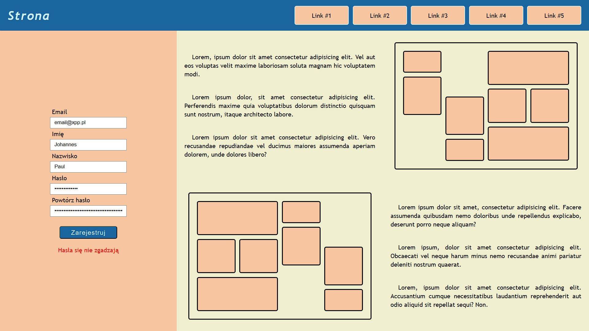

# Projekt witryny

## Zawartość
* Witryna napisana w języku *HTML5*, w pliku o nazwie **index** z odpowiednim rozszerzeniem.
* Zadeklarowany język zawartości witryny - **polski**.
* Tytuł strony widoczny na karcie przeglądarki - **Strona**.
* Witryna jest podzielona na *semantyczne elementy blokowe*.

## Wygląd

* Strona powinna w jak największym stopniu przypominać załączoną grafikę.
* Style zdefiniowane w oddzielnym pliku CSS o nazwie **main** i odpowiednim rozszerzeniu.
* Zastosowane kolory:
  * belka górna - 1a659e16,
  * formularz: f7c59f16,
  * artykuł - efefd016,
  * jasna czcionka - cbeef316,
  * ciemna czcionka - 0a090816.
* Krój czcionki: **Trebuchet MS**.
* Należy zadbać o podstawową responsywność.
* Przycisk ma nieznacznie zwiększać swoje wymiary po najechaniu na niego kursorem.
* Wielkość tekstu linków ma się delikatnie zwiększyć po najechaniu na nie kursorem.

---

### Oczekiwany wygląd witryny

## Działanie

* Skrypt napisany w oddzielnym pliku o nazwie **script** i odpowiednim rozszerzeniu.
* Po kliknięciu przycisku ma nastąpić sprawdzenie pól pod kątem poprawności, pod formularzem wyświetlany jest odpowiedni komunikat. Kryteria:
  * wszystkie pola są wypełnione,
  * hasło ma minimum osiem znaków,
  * hasła się zgadzają.
* W przypadku poprawnie wypełnionego formularza komunikat jest zielony, a w przypadku niepoprawnie wypełnionego - czerwony.

