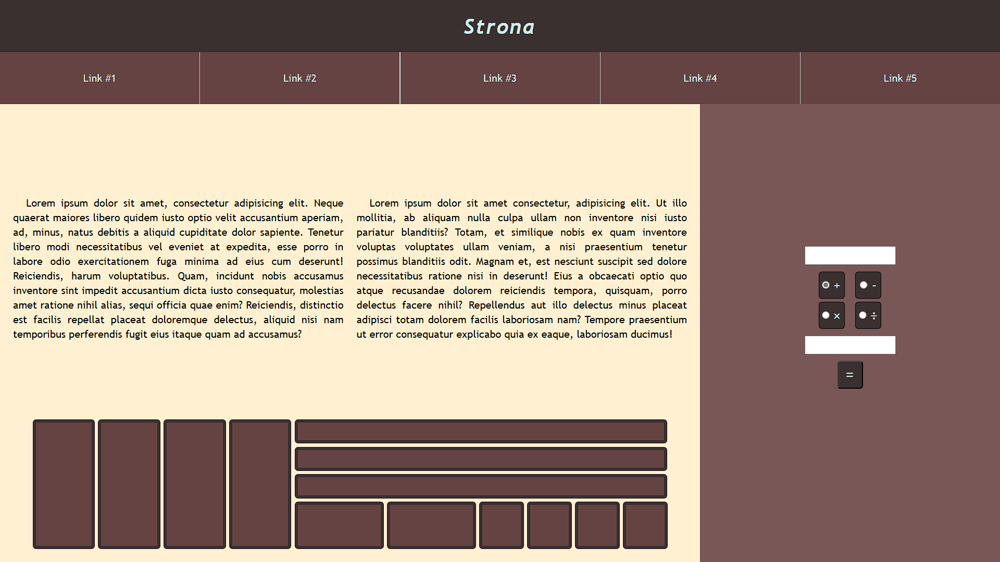
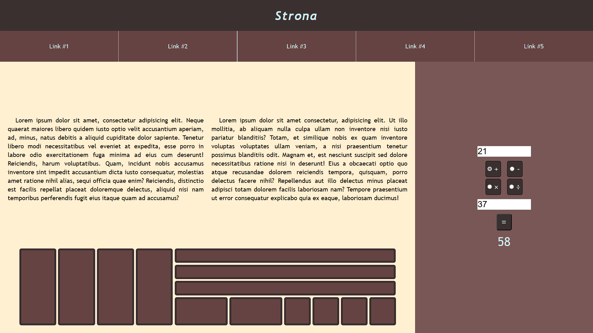

# Projekt witryny

## Zawartość
* Witryna napisana w języku *HTML5*, w pliku o nazwie **index** z odpowiednim rozszerzeniem.
* Zadeklarowany język zawartości witryny - **polski**.
* Tytuł strony widoczny na karcie przeglądarki - **Strona**.
* Witryna jest podzielona na *semantyczne elementy blokowe*.

## Wygląd

* Strona powinna w jak największym stopniu przypominać załączoną grafikę.
* Style zdefiniowane w oddzielnym pliku CSS o nazwie **main** i odpowiednim rozszerzeniu.
* Zastosowane kolory:
  * belka górna - 3B303016,
  * nawigacja - 66434316,
  * formularz: 79575716,
  * artykuł - FFF0D116,
  * jasna czcionka - cbeef316,
  * ciemna czcionka - 0a090816.
* Krój czcionki: **Trebuchet MS**.
* Należy zadbać o podstawową responsywność.
* Przyciski mają zmieniać kolor tła na delikatnie jaśniejszy po najechaniu na nie kursorem.

---

### Oczekiwany wygląd witryny

## Działanie

* Skrypt napisany w oddzielnym pliku o nazwie **script** i odpowiednim rozszerzeniu.
* Po wpisaniu wartości liczbowych do pól, zaznaczeniu odpowiedniego znaku i naciśnięciu przycisku wykonywane jest odpowiednie działanie.
* Wynik wyświetlany jest poniżej przycisku.
* W przypadku nieprawidłowego działania wyświetlany jest stosowny komunikat.

