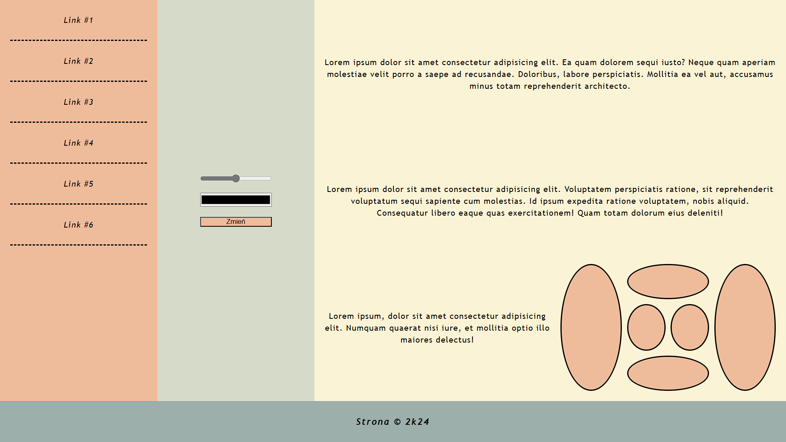
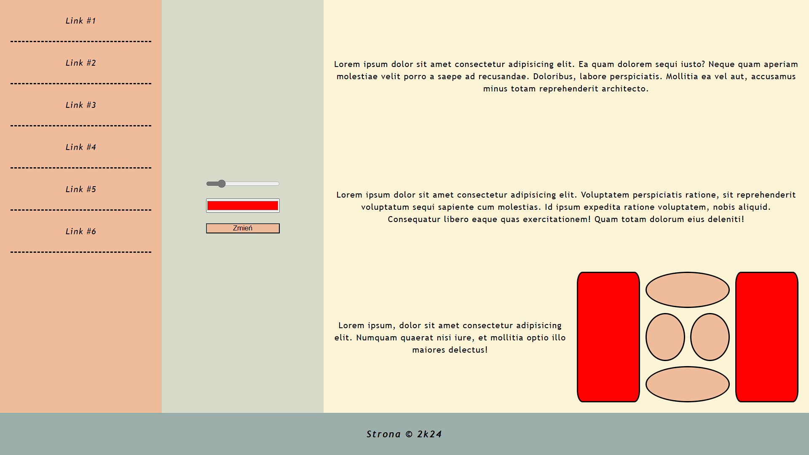

# Projekt witryny

## Zawartość
* Witryna napisana w języku *HTML5*, w pliku o nazwie **index** z odpowiednim rozszerzeniem.
* Zadeklarowany język zawartości witryny - **polski**.
* Tytuł strony widoczny na karcie przeglądarki - **Strona**.
* Witryna jest podzielona na *semantyczne elementy blokowe*.

## Wygląd

* Strona powinna w jak największym stopniu przypominać załączoną grafikę.
* Style zdefiniowane w oddzielnym pliku CSS o nazwie **index** i odpowiednim rozszerzeniu.
* Zastosowane kolory:
  * nawigacja - `#EFBC9B`,
  * formularz: `#D6DAC8`,
  * artykuł - `#FBF3D5`,
  * stopka - `#9CAFAA`,
  * jasna czcionka - `#cbeef3`,
  * ciemna czcionka - `#0a0908`.
* Krój czcionki: **Trebuchet MS**.
* Należy zadbać o podstawową responsywność.
* Po najechaniu na link, kolor tła zmienia się płynnie na delikatnie jaśniejszy.

---

### Oczekiwany wygląd witryny

## Działanie

* Skrypt napisany w oddzielnym pliku o nazwie **main** i odpowiednim rozszerzeniu.
* Zarządzanie wyglądem bloczków przy pomocy formularza.
* Wartość suwaka z zakresu *[0; 50]* ma określać zaokrąglenie krawędzi wyrażone w procentach.
* Wybrany kolor definiuje kolor tła bloczków.

