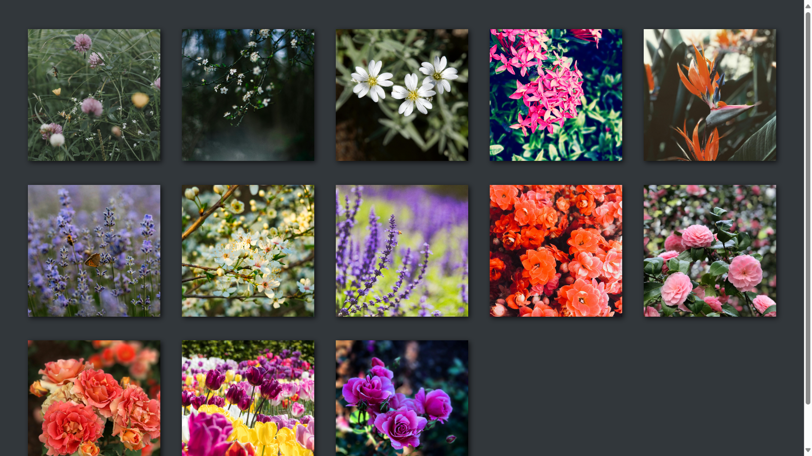
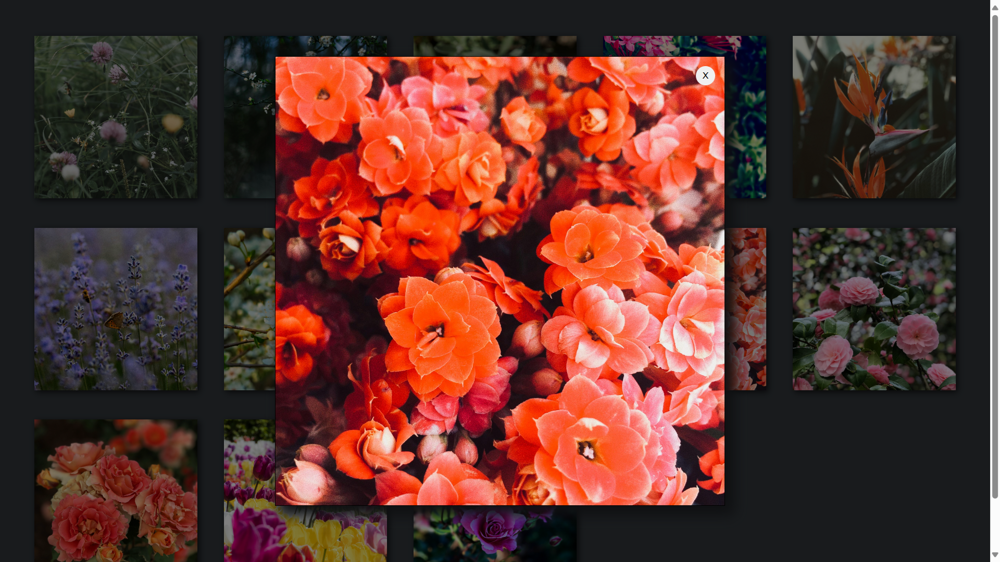

# Galeria zdjęć

Stworzyć stronę internetową będącą zbiorem zdjęć o wybranej tematyce. 

## Zawartość

* Witryna napisana w języku HTML5, w pliku o nazwie **"index"** z odpowiednim rozszerzeniem.

* Zastosowany właściwy *standard kodowania* polskich znaków.

* Zadeklarowany język zawartości witryny – **polski**.

* Tytuł strony widoczny na karcie przeglądarki – **"Gallery"**.

* Witryna jest podzielona na *semantyczne elementy blokowe*.

## Wygląd

* Style zdefiniowane w oddzielnym pliku CSS o nazwie **"main"** i odpowiednim rozszerzeniem.

* Zewnętrzny arkusz stylów prawidłowo połączony ze stroną.

* Pozycjonowanie elementów zrealizowane przy pomocy `flex` lub `grid`.

## Wymagania

* Zdjęcia ułożone w siatkę, dostosowującą się do wymiarów ekranu.

* Po najechaniu na dane zdjęcie, zostaje ono wyróżnione.

* *Lightbox* - po kliknięciu pojawia się ciemna nakładka, a wybrane zdjęcie zostaje zaprezentowane na środku ekranu.

* Po wybraniu zdjęcia pojawiają się trzy przyciski, dwa odpowiedzialne za przewijanie zdjęć oraz jeden za zamknięcie lightboxa.

---
&nbsp;

Przykładowa witryna spełniająca część wymogów:

