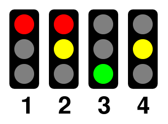

# Projekty

## 1. Sygnalizacja świetlna

Aplikacja do sterowania sygnalizacją świetlną, opierająca się na czterofazowym układzie.

#### Funkcjonalności:

- Graficzna reprezentacja trzech świateł sygnalizacji - czerwone, żółte i zielone.
- Wyświetlanie obecnego stanu sygnalizacji.
- Tryb ręczny - zmiana stanu sygnalizacji po naciśnięciu przycisku.
- Tryb automatyczny - automatyczna zmiana stanu sygnalizacji po określonym czasie.
- Możliwość wybierania trybu.
- Odliczanie do zmiany stanu w trybie automatycznym.

## 2. Winda

Symulator działania windy w budynku wielopiętrowym. Użytkownik ma możliwość wyboru piętra, na które zostanie wezwana winda.

- Graficzna reprezentacja windy i pięter.
- Przycisk przywoływania windy na każdym piętrze.
- Przyciski odnoszące się do poszczególnych pięter.
- Animacja przejazdu windy.
- Wyświetlanie aktualnego piętra i kierunku jazdy.

## 3. Parking

Symulator parkingu samochodowego, pozwalający na obserwowanie zajętości miejsc.

#### Funkcjonalności:

- Graficzna reprezentacja parkingu, w zależności od wymiarów podanych przez użytkownika.
- Mechanika zwalniania i zajmowania miejsc - zmiana statusu po kliknięciu.
- Licznik zajętych i wolnych miejsc, wyświetlanie obłożenia w procentach.
- Reset parkingu - zwolnienie miejsc i zresetowanie liczników.
- Podział na tryb ręczny i automatyczny. W trybie automatycznym, co kilka sekund, miejsca są losowo zwalniane i zajmowane.

## 4. Lista obecności

Aplikacja do zarządzania listą uczniów i oznaczania ich obecności na zajęciach.

Funkcjonalności:

- Wyświetlanie listy uczniów.
- Dodawanie nowych uczniów poprzez formularz.
- Usuwanie uczniów z listy.
- Możliwość wybrania jednego z trzech stanów - obecność, nieobecność, spóźnienie, przy danym uczniu.
- Licznik obecnych, nieobecnych oraz spóźnionych uczniów.
- Filtrowanie listy uczniów po stanie obecności.
