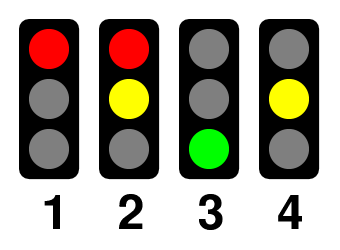

# Projekty

## 1. Sygnalizacja świetlna

Aplikacja do sterowania sygnalizacją świetlną, opierająca się na czterofazowym układzie.

#### Funkcjonalności:

- Graficzna reprezentacja trzech świateł sygnalizacji - czerwone, żółte i zielone.
- Wyświetlanie obecnego stanu sygnalizacji.
- Tryb ręczny - zmiana stanu sygnalizacji po naciśnięciu przycisku.
- Tryb automatyczny - automatyczna zmiana stanu sygnalizacji po określonym czasie.
- Możliwość wybierania trybu.
- Odliczanie do zmiany stanu w trybie automatycznym.

## 2. Winda

Symulator działania windy w budynku wielopiętrowym. Użytkownik ma możliwość wyboru piętra, na które zostanie wezwana winda.

- Graficzna reprezentacja windy i pięter.
- Przycisk przywoływania windy na każdym piętrze.
- Przyciski odnoszące się do poszczególnych pięter.
- Animacja przejazdu windy.
- Wyświetlanie aktualnego piętra i kierunku jazdy.

## 3. Parking

Symulator parkingu samochodowego, pozwalający na obserwowanie zajętości miejsc.

#### Funkcjonalności:

- Graficzna reprezentacja parkingu, w zależności od wymiarów podanych przez użytkownika.
- Mechanika zwalniania i zajmowania miejsc - zmiana statusu po kliknięciu.
- Licznik zajętych i wolnych miejsc, wyświetlanie obłożenia w procentach.
- Reset parkingu - zwolnienie miejsc i zresetowanie liczników.
- Podział na tryb ręczny i automatyczny. W trybie automatycznym, co kilka sekund, miejsca są losowo zwalniane i zajmowane.

## 4. Lista obecności

Aplikacja do zarządzania listą uczniów i oznaczania ich obecności na zajęciach.

Funkcjonalności:

- Wyświetlanie listy uczniów.
- Dodawanie nowych uczniów poprzez formularz.
- Usuwanie uczniów z listy.
- Możliwość wybrania jednego z trzech stanów - obecność, nieobecność, spóźnienie, przy danym uczniu.
- Licznik obecnych, nieobecnych oraz spóźnionych uczniów.
- Filtrowanie listy uczniów po stanie obecności.

## 5. Dziennik ocen (*)

Symulator prostego dziennika szkolnego.

Funkcjonalności:

- Wyświetlanie listy uczniów oraz ich ocen.
- Możliwość dodawania nowych uczniów poprzez formularz.
- Możliwość usuwania uczniów z listy.
- Możliwość wpisywania ocen o podanej kategorii, wadze, opisie oraz dacie wstawienia. Kategoria powinna być wybierana spośród istniejących. Data powinna pokrywać się z czasem wstawienia oceny, chyba że użytkownik zadecyduje inaczej.
- Możliwość usuwania ocen.
- Obliczanie i wyświetlanie średniej ocen danego ucznia.
- Sortowanie listy uczniów po numerze w dzienniku, alfabetycznie po nazwisku oraz po średniej.
- Filtrowanie listy uczniów po nazwisku lub progu średniej.

## 6. Sterownik klimatyzacji

Aplikacja symulująca panel sterowania klimatyzacją, umożliwiającą użytkownikowi kontrolę temperatury i trybu pracy urządzenia.

Funkcjonalności:

- Wyświetlanie aktualnej temperatury.
- Możliwość ustalenia temperatury docelowej.
- Wybór trybu pracy - chłodzenie, ogrzewanie, wentylacja, wyłączone. Wizualna informacja o stanie - kolor tła zależy od trybu.
- Przycisk resetujący ustawienia.
- Symulacja zmiany temperatury w pomieszczeniu.
- Sterowanie za pomocą klawiatury.

## 7. Smart Home (*)

Aplikacja symulująca panel sterowania systemem Smart Home, umożliwiająca sterowanie różnymi urządzeniami oraz monitorowanie ich stanu.

Funkcjonalności:

- Wyświetlanie listy urządzeń - *ikona*, *nazwa* i *status*.
- Możliwość sterowania poszczególnymi urządzeniami. Predefiniowana lista dostępnych urządzeń, z których każde posiada indywidualne opcje.
- Wybór jednego z trybów - *normalny*, *nocny*, *poza domem*. Każdy z trybów cechują inne opcje poszczególnych urządzeń.
- Historia zdarzeń - lista zmian opcji urządzeń.

## 8. System rezerwacji wizyt

Aplikacja umożliwia użytkownikom przeglądanie dostępnych terminów oraz rezerwację wizyt w wybranym przedziale czasowym.

Funkcjonalności:

- Wyświetlanie kalendarza lub listy dostępnych dni. Dostępnie terminy między 08:00, a 16:00, co 30 minut.
- Rezerwacja danego terminu, w ramach pewnej usługi (na przykład strzyżenie, masaż, konsultacja...). Każda usługa może trwać wielokrotność 30 minut (30, 60, 90, 120...). Usługa ma określoną cenę oraz przypisaną ikonkę.
- Możliwość anulowania rezerwacji.
- Możliwość edytowania rezerwacji.

## 9. System kolejkowy

Aplikacja symulująca system kolejkowy stosowany w urzędach. Użytkownik pobiera numer, a stanowisko obsługi wywołuje kolejne osoby.

Funkcjonalności:

- Pobieranie numeru za pomocą przycisku.
- Wyświetlanie oczekujących numerków, wyświetlanie aktualnie obsługiwanego numeru.
- System obsługi klienta.
- Podział na tryb ręczny i automatyczny - obsługa kolejnego klienta przy pomocy przycisku lub po danym czasie.
- Reset systemu.

## 10. System zgłoszeń w helpdesku

Aplikacja symulująca system obsługi zgłoszeń technicznych, w którym użytkownicy zgłaszają problemy, a pracownik wsparcia technicznego obsługuje je w kolejności zgłoszeń.

Funkcjonalności:

- Dodawanie złoszeń poprzez podanie tytułu, predefiniowanej kategorii i krótkiego opisu problemu.
- Wyświetalenie listy zgłoszeń oraz ich statusu (*nowe*, *w trakcie*, *rozwiązane*).
- Obsługa zgłoszeń.
- Filtrowanie zgłoszeń po kategorii i statusie. Sortowanie zgłoszeń alfabetycznie po tytule oraz po czasie dodania.
- Licznik zgłoszeń z podziałem na status.
