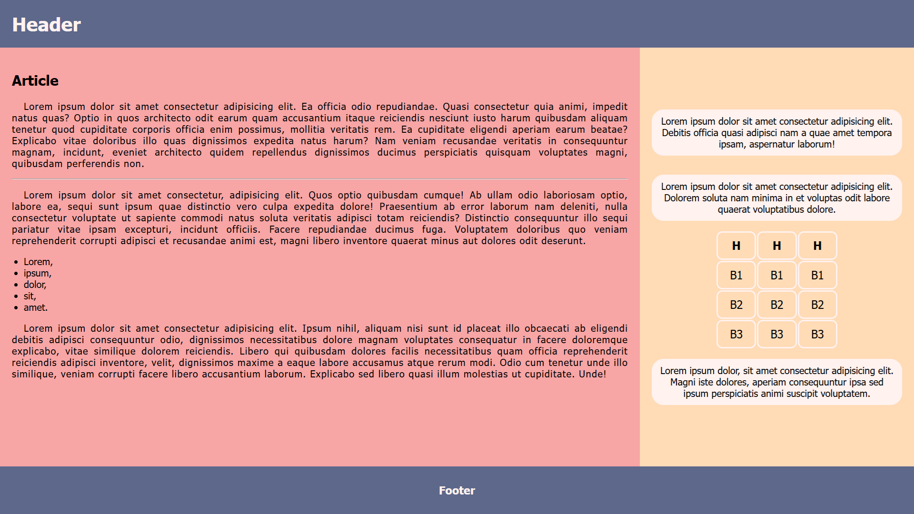
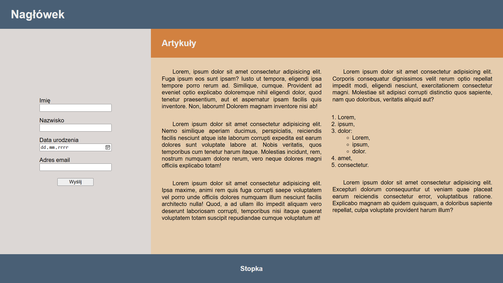
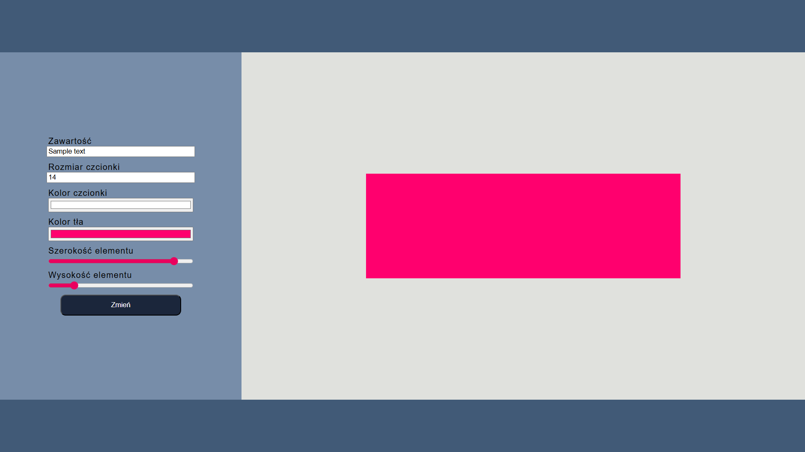
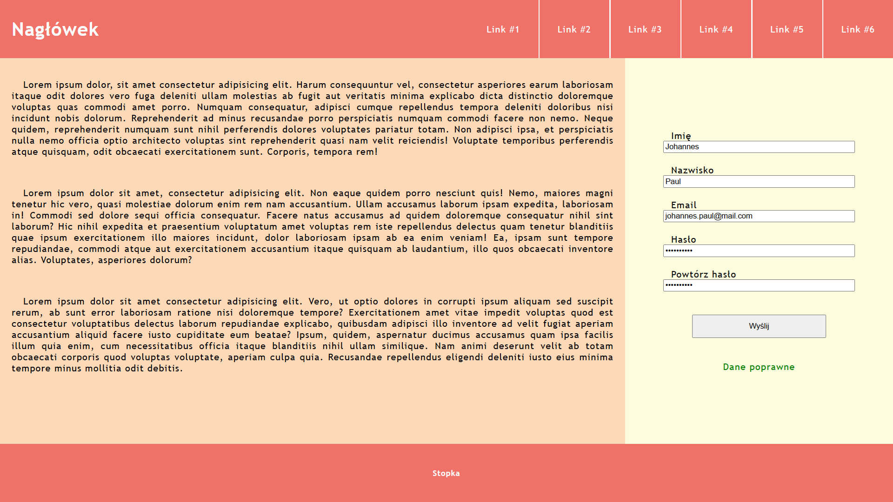

# Projekty

## 1. Układanie i stylizowanie podstawowych elementów witryny #1

### Zawartość
* Witryna napisana w języku *HTML5*, w pliku o nazwie **index** z odpowiednim rozszerzeniem.
* Zadeklarowany język zawartości witryny - **angielski**.
* Tytuł strony widoczny na karcie przeglądarki - **Page**.
* Prawidłowo połączony zewnętrzny arkusz stylów.
* Witryna jest podzielona na *semantyczne elementy blokowe*.
* Strona składa się z *belki górnej* z *nagłówkiem*, *części głównej* oraz *belki dolnej* z *nagłówkiem*.
* *Część główna* podzielona jest na *artykuł* i *część poboczną*.
* W *artykule* znajduje się *nagłówek*, *akapit*, *pozioma linia*, *akapit*, pięcioelementowa *lista nienumerowana* i kolejny *akapit*.
* *Część poboczna* zawiera dwa *akapity*, *tabelę* o wymiarach *3 x 4* oraz kolejny *akapit*.

### Wygląd

* Strona powinna w jak największym stopniu przypominać załączoną grafikę.
* Style zdefiniowane w oddzielnym pliku CSS o nazwie **index** i odpowiednim rozszerzeniu.
* Zastosowane kolory:
  * `#5D688A`,
  * `#F7A5A5`,
  * `#FFDBB6`,
  * `#FFF2EF`.
* Krój czcionki: **Tahoma**.
* Należy zadbać o podstawową responsywność.

### Oczekiwany wygląd witryny

## 2. Układanie i stylizowanie podstawowych elementów witryny #2

### Zawartość
* Witryna napisana w języku *HTML5*, w pliku o nazwie **main** z odpowiednim rozszerzeniem.
* Zadeklarowany język zawartości witryny - **polski**.
* Tytuł strony widoczny na karcie przeglądarki - **Strona**.
* Prawidłowo połączony zewnętrzny arkusz stylów.
* Witryna jest podzielona na *semantyczne elementy blokowe*.
* Strona składa się z *belki górnej* z *nagłówkiem*, *części głównej* oraz *belki dolnej* z *nagłówkiem*.
* *Część główna* podzielona jest na *formularz* i *artykuł*.
* Formularz zawiera cztery *pola wprowadzania* o odpowiednim typie, poprzedzone prawidłowo połączonymi *etykietami*, oraz *przycisk*.
* W *artykule* znajduje się *nagłówek* i dwie *sekcje* podzielone na *akapity*.
* W jednej z *sekcji* znajduje się zagnieżdżona *lista*.

### Wygląd

* Strona powinna w jak największym stopniu przypominać załączoną grafikę.
* Style zdefiniowane w oddzielnym pliku CSS o nazwie **main** i odpowiednim rozszerzeniu.
* Zastosowane kolory:
  * `#495F75`,
  * `#D28140`,
  * `#E6CDAE`,
  * `#DCD7D5`.
* Krój czcionki: **Arial**.
* Należy zadbać o podstawową responsywność.

### Oczekiwany wygląd witryny

## 3. Podstawy obsługi formularza #1

### Zawartość
* Witryna napisana w języku *HTML5*, w pliku o nazwie **main** z odpowiednim rozszerzeniem.
* Zadeklarowany język zawartości witryny - **polski**.
* Tytuł strony widoczny na karcie przeglądarki - **Strona**.
* Prawidłowo połączony zewnętrzny arkusz stylów.
* Witryna jest podzielona na *semantyczne elementy blokowe*.

* Strona składa się z *belki górnej*, *części głównej* oraz *belki dolnej*.
* *Część główna* podzielona jest na *formularz* i *sekcję*.
* Formularz zawiera sześć *pól wprowadzania* o odpowiednim typie, poprzedzone prawidłowo połączonymi *etykietami*, oraz *przycisk*.
* W *sekcji* znajduje się *element blokowy*.

### Wygląd

* Strona powinna w jak największym stopniu przypominać załączoną grafikę.
* Style zdefiniowane w oddzielnym pliku CSS o nazwie **main** i odpowiednim rozszerzeniu.
* Zastosowane kolory:
  * `#1B263B`,
  * `#415A77`,
  * `#778DA9`,
  * `#E0E1DD`,
* Krój czcionki: **Helvetica**.
* Należy zadbać o podstawową responsywność.

### Działanie

Po naciśnięciu przycisku pobierane są wartości podane przez użytkownika - *zawartość*, *rozmiar* i *kolor czcionki*, *kolor tła* oraz *wymiary* elementu, a następnie przypisywane elementowi blokowemu.

### Oczekiwany wygląd witryny

## 4. Podstawy obsługi formularza #2

### Zawartość
* Witryna napisana w języku *HTML5*, w pliku o nazwie **index** z odpowiednim rozszerzeniem.
* Zadeklarowany język zawartości witryny - **polski**.
* Tytuł strony widoczny na karcie przeglądarki - **Strona**.
* Prawidłowo połączony zewnętrzny arkusz stylów.
* Witryna jest podzielona na *semantyczne elementy blokowe*.

* Strona składa się z *belki górnej*, *części głównej* oraz *belki dolnej*.
* *Belka górna* zawiera nagłówek pierwszego stopnia oraz nawigację z sześcioma odnośnikami.
* *Część główna* podzielona jest na *artykuł* *formularz*.
* W *artykule* znajdują się trzy *akapity*.
* Formularz zawiera pięć *pól wprowadzania* o odpowiednim typie, poprzedzone prawidłowo połączonymi *etykietami*, *przycisk* oraz *akapit*.

### Wygląd

* Strona powinna w jak największym stopniu przypominać załączoną grafikę.
* Style zdefiniowane w oddzielnym pliku CSS o nazwie **index** i odpowiednim rozszerzeniu.
* Zastosowane kolory:
  * `f07167`16,
  * `fed9b7`16,
  * `fdfcdc`16,
* Krój czcionki: **'Trebuchet MS'**.
* Należy zadbać o podstawową responsywność.

### Działanie

Po naciśnięciu przycisku pobierane są wartości podane przez użytkownika - *imię*, *nazwisko*, *adres email*, *hasło* oraz *powtórzone hasło*. Następnie wprowadzone dane są sprawdzane pod kątem poprawności. *Imię*, *nazwisko* i *email* powinny mieć przynajmnniej trzy litery, *hasło* przynajmniej osiem, ponadto *hasła* powinny być takie same. W zależności czy dane są poprawne wpisz w akapit poniżej przycisku tekst **Dane poprawne** lub **Dane niepoprawne**.

### Oczekiwany wygląd witryny

