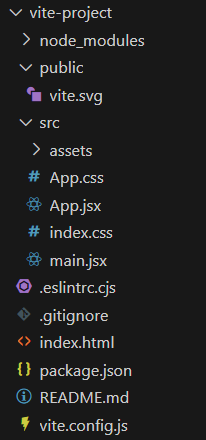

# Spis treści<!-- omit in toc -->

1. [Wprowadzenie](#wprowadzenie)
   - [Umieszczanie skryptu na stronie](#umieszczanie-skryptu-na-stronie)
   - [Komunikaty konsoli](#komunikaty-konsoli)
2. [Zmienne](#zmienne)
   - [Zmienne i stałe](#zmienne-i-stałe)
   - [Typy danych](#typy-danych)
   - [Konwersje typów](#konwersje-typów)
3. [Operatory](#operatory)
   - [Operatory arytmetyczne](#operatory-arytmetyczne)
   - [Dodatkowe operatory przypisania](#dodatkowe-operatory-przypisania)
   - [Operatory relacyjne](#operatory-relacyjne)
   - [Operatory logiczne](#operatory-logiczne)
4. [Komunikacja z użytkownikiem](#komunikacja-z-użytkownikiem)
5. [Instrukcje warunkowe](#instrukcje-warunkowe)
   - [Konstrukcja instrukcji warunkowej](#konstrukcja-instrukcji-warunkowej)
   - [Złożone instrukcje warunkowe](#złożone-instrukcje-warunkowe)
   - [Switch](#switch)
   - [Polecenia - instrukcje warunkowe](#polecenia---instrukcje-warunkowe)
6. [Document Object Model](#document-object-model)
   - [Pobieranie elementu](#pobieranie-elementu)
   - [Zarządzanie własnościami elementów](#zarządzanie-własnościami-elementów)
   - [Polecenia #1 - Document Object Model](#polecenia-1---document-object-model)
   - [Obsługa zdarzeń](#obsługa-zdarzeń)
   - [Polecenia #2 - Document Object Model](#polecenia-2---document-object-model)
7. [PHP](#php)
   - [Wprowadzenie](#wprowadzenie)
   - [Tablice](#tablice)
   - [Funkcje](#funkcje)
   - [Polecenia - podstawy](#polecenia---podstawy)
   - [Formularze](#formularze)
   - [Polecenia - formularze](#polecenia---formularze)
   - [Łączenie z bazą danych](#łączenie-z-bazą-danych)
   - [Wysyłanie zapytań SQL](#wysyłanie-zapytań-sql)
   - [Polecenia - bazy danych](#polecenia---bazy-danych)
8. [React](#react)
   - [Instalacja](#instalacja)
   - [Tworzenie projektu](#tworzenie-projektu)
   - [Struktura projektu](#struktura-projektu)
   - [Podstawowa aplikacja](#podstawowa-aplikacja)
   - [Propsy](#propsy)
   - [useState](#usestate)

<a name = "wprowadzenie"></a>
# 1. Wprowadzenie

**JavaScript** to **hybrydowy język programowania** wykorzystywany między innymi na stronach internetowych.

## Umieszczanie skryptu na stronie

Na stronie można umieścić skrypt na dwa podstawowe sposoby. Wykorzystujemy w tym celu znacznik `<script>`, zazwyczaj na końcu kodu witryny.

```html
<!DOCTYPE html>
<html lang = "en">
<head>
    <meta charset = "UTF-8">
    <title>Document</title>
</head>
<body>

    <p>Lorem ipsum</p>

    <script>
        console.log("Hello world!");
    </script>

</body>
</html>
```

<p align = "right">1.1. Umieszczanie skryptu na stronie</p>

W przypadku niewielkich skryptów, cały kod można umieścić pomiędzy znacznikami `<script>`.

```html
<!DOCTYPE html>
<html lang = "en">
<head>
    <meta charset = "UTF-8">
    <title>Document</title>
</head>
<body>

    <p>Lorem ipsum</p>
    
    <script src = "main.js"></script>

</body>
</html>
```

<p align = "right">1.2. Importowanie skryptu</p>

Zazwyczaj jednak skrypt umieszczamy w oddzielnym pliku o rozszerzeniu `js`, a następnie importujemy, podając jego ścieżkę w atrybucie `src`.

> Jeżeli znacznik `<script>` posiada atrybut `src`, powinien pozostać pusty.

## Komunikaty konsoli

W prostych przypadkach testowania kodu często posługujemy się komunikatami konsoli. Wyróżniamy trzy podstawowe **metody**:

```js
console.log("Informacja");
```
```js
console.warn("Ostrzeżenie");
```
```js
console.error("Błąd");
```

<p align = "right">1.3. Komunikaty konsoli</p>

Różnią się one pomiędzy sobą wyglądem w konsoli. Przy ich pomocy można wyświetlać na przykład komunikaty, czy wartości poszczególnych **zmiennych**.

<a name = "zmienne"></a>
# 2. Zmienne

Zmienna to pewne wydzielone miejsce w pamięci komputera, gdzie mogą być przechowywane dane. Wartością zmiennej może być na przykład liczba lub ciąg znaków. Zmienna musi posiadać nazwę symboliczną, przez którą można odwoływać się do niej w kodzie.

## Zmienne i stałe

```js
let zmienna;
```

<p align = "right">2.1. Deklaracja zmiennej</p>

Przy **deklarowaniu** zmiennej korzystamy ze słowa kluczowego `let`.

```js
const stala = 3.14;
```

<p align = "right">2.2. Deklaracja stałej</p>

W przypadku stałej, wymaganym słowem kluczowym jest `const`. Wartości stałej nie jesteśmy już w stanie zmienić po jej utworzeniu, zatem musimy od razu ją **zainicjalizować**, korzystając ze znaku przypisania `=`.

```js
let x = 9;

x = 11;
```

<p align = "right">2.3. Nadpisywanie zmiennej</p>

Po zadeklarowaniu zmiennej lub stałej, przy kolejnych odołaniach pomijamy słowa kluczowe.

## Typy danych

**JavaScript** cechuje **typowanie dynamiczne**, oznacza to, że nie musimy jawnie wskazywać typu danej zmiennej. Jest on nadawany automatycznie w zależności od przechowywanej przez nią wartości. Podstawowe typy wbudowane oferowane przez język to:

- `Number` - liczba,
- `String` - ciąg/łańcuch znaków, napis,
- `Boolean` - wartość logiczna,
- `Object` - obiekt,
- `Null` - brak wartości,
- `Undefined` - wartość nieokreślona.

## Konwersje typów

Wartości można **konwertować** pomiędzy poszczególnymi typami, dzięki temu mogą zostać inaczej interpretowane. W tym celu posłużą nam funkcje wbudowane:
- `parseInt` - rzutowanie na liczbę zmiennoprzecinkową,
- `parseFloat` - rzutowanie na liczbę całkowitą.

```js
const number = 2.13;
const integer = parseInt(number);
```

<p align = "right">2.4. Konwersja na inny typ</p>

<a name = "operatory"></a>
# 3. Operatory

**JavaScript** podobnie jak inne języki oferuje szereg różnych operatorów, dzięki którym możemy operować na wartościach.

## Operatory arytmetyczne

|Operator|Opis|Przykład|
|:-:|:--|:-:|
|`+`|Dodawanie|`a + 4`|
|`-`|Odejmowanie|`1 - b`|
|`*`|Mnożenie|`7 * 8`|
|`/`|Dzielenie|`a / 1.5`|
|`%`|Reszta z dzielenia (*modulo*)|`a % 2`|
|`**`|Potęgowanie|`b ** 2`|

## Dodatkowe operatory przypisania

Często będziemy musieli zmieniać wartość danej zmiennej, nadpisując ją inną wartością.

```js
let number = 5
number = number + 2
```

Przykładowo, liczbę możemy nadpisać wartością o 2 większą, przypisując jej nową wartość w postaci sumy jej starej wartości i liczby 2. Taki zapis można skrócić przy pomocy danych operatorów dwuargumentowych:

- `+=`,
- `-=`,
- `*=`,
- `/=`,
- `%=`.
- `**=`.

Oraz jednoargumentowych:
- `++`,
- `--`.

Operator `++` odpowiedzialna jest za zwiększenie wartości zmiennej o *1*. Jest to tak zwana **inkrementacja**. Zmniejszenie wartości o *1* nazywamy **dekrementacją** i oznaczamy przez `--`.

## Operatory relacyjne

**Operatory relacyjne** są wykorzystywane najczęściej jako elementy warunków pętli lub instrukcji warunkowcyh. Zwracają one wartość logiczną.

|Operator|Opis|Przykład|
|:-:|:--|:-:|
|`==`|Równe (wartości)|`a == "4"`|
|`===`|Równe (wartości i typy)|`a === "4"`|
|`!=`|Różne (wartości)|`b != 3`|
|`!==`|Różne (wartości lub typy)|`b !== "−3"`|
|`>`|Większe|`a > b`|
|`>=`|Większe lub równe|`b >= −4`|
|`<`|Mniejsze|`2 < a`|
|`<=`|Mniejsze lub równe|`a <= b`|

## Operatory logiczne

Operatory logiczne używa się do konstruowania warunków złożonych.

|Operator|Opis|Przykład|
|:-:|:--|:-:|
|`&&`|Koniunkcja (i, oraz, *and*)|`a > −4 && a < = 4`|
|`\|\|`|Alternatywa (lub, *or*)|`b === −2 \|\| b === 2`|
|`!`|Negacja (*not*)|`!b`|

<a name = "komunikacja-z-uzytkownikiem"></a>
# 4. Komunikacja z użytkownikiem

Najprostszym i najbardziej prymitywnym sposobem komunikacji z użytkownikiem są okna dialogowe. Wyróżniamy kilka podstawowych metod:

```js
window.alert("Informacja");
```

<p align = "right">4.1. Alert popup</p>

Metoda `alert` wyświetla informację.

```js
const value = window.confirm("Potwierdzenie");
```

<p align = "right">4.2. Confirm popup</p>

`confirm` wyświetla tekst, oczekując wybrania jednego z dwóch przycisków. Metoda zwraca wartość logiczną w zależności od wyboru, którą można przypisać na przykład do zmiennej i wykorzystać na dalszym etapie.

```js
const value = window.prompt("Pytanie");
```

<p align = "right">4.3. Prompt popup</p>

Metoda `prompt` wyświetla tekst, oczekując wprowadzenie tekstu, po wciśnięciu przycisku wartość jest zwracana.

> Każda wartość wprowadzona przez użytkownika poprzez klawiaturę jest interpretowana jako ciąg znaków. Jeżeli oczekujemy innej interpretacji należy zastosować zmianę typu.

<a name = "instrukcje-warunkowe"></a>
# 5. Instrukcje warunkowe

Instrukcje warunkowe w programowaniu służą do warunkowego wykonywania instrukcji, w zależności od tego, czy dany warunek jest spełniony.

## Konstrukcja instrukcji warunkowej

Instrukcja warunkowa jest spełniona, gdy zawarty w niej warunek jest prawdziwy - zwraca wartość logiczną `true`. W przypadku wartości fałszywej - `false`, wskazane instrukcje nie zostaną wykonane.

```js
const condition = true;

if (condition) {

    console.log("Warunek jest spełniony");
}
```

<p align = "right">5.1. Instrukcja warunkowa</p>

Po słowie kluczowym `if`, wewnątrz nawiasów okrągłych, następuje warunek. Blok kodu, czyli wszystkie instrukcje, które mają zostać wykonane w obrębie instrukcji warunkowej (mają zostać wykonane pod warunkiem), wyznaczają nawiasy klamrowe. Warunkiem może być zmienna lub całe wyrażenie.

> W powyższym przykładzie sprawdzana jest wartość zmiennej condition. Została ona zainicjowana wartością `true` - wartość jest prawdą, co jest równoznaczne ze spełnieniem warunku.

```js
if (condition)
    console.log("Warunek jest spełniony");
```

<p align = "right">5.2. Jednolinijkowa instrukcja warunkowa</p>

W przypadku pojedynczej linii kodu, można pominąć nawiasy klamrowe.

## Złożone instrukcje warunkowe

Po instrukcji `if` można dodawać warunki alternatywne za pośrednictwem instrukcji `else if`. Na samym końcu można dodatkowo zdefiniować działanie dla pozostałych przypadków - czyli sytuacji, w której żaden z poprzednich warunków nie został spełniony - `else`.

```js
const number = 2.13;

if (number > 0)
    console.log("Liczba jest dodatnia.")

else if (number < 0)
    console.log("Liczba jest ujemna.")

else
    console.log("Liczba jest równa 0.")
```

<p align = "right">5.3. Konstrukcja instrukcji warunkowej</p>

## Switch

W przypadku bardzo precyzyjnych warunków instrukcje warunkowe mogą okazać się niewystarczająco czytelne. Alternatywą może być konstrukcja `switch`.

```js
const key = 'b';

switch (key) {

    case 'a':

        console.log("Wprowadzona litera to 'a'.");
        break;

    case 'b':

        console.log("Wprowadzona litera to 'b'.");
        break;

    default:

        console.log("Wprowadzono inną literę.");
        break;
}
```

<p align = "right">5.4. Instrukcja switch</p>

Po słowie kluczowym `switch` wskazujemy zmienną, której wartość zadecyduje o przeprowadzonych operacjach. W zależności od jej wartości wybierany jest odpowiedni przypadek - `case`. Na końcu umieszczamy przypadek domyślny - `default`. Każdy przypadek kończymy instrukcją `break`.

## Polecenia - instrukcje warunkowe

1. Zadeklarować **zmienną** i zainicjalizować ją wartością liczbową pobraną od użytkownika (`prompt`), sprawdzić czy jest parzysta i w zależnośći od wyniku wyświetlić odpowiedni komunikat (`alert`).
2. Zadeklarować **stałą** i zainicjalizować ją wartością pobraną od użytkownika (`prompt`), sprawdzić czy leży w przedziale *(5; 20]* i w zależnośći od wyniku wyświetlić odpowiedni komunikat (`alert`).
3. Zadeklarować dwie **stałe** i zainicjalizować je wartościmi pobranymi od użytkownika (`prompt`), a następnie wyświetlić ich średnią arytmetyczną (`alert`).
4. Wykorzystując instrukcję `switch`, napisać kalkulator prosty. Skrypt, przy pomocy `prompt`, powinien pobierać trzy wartości od użytkownika. Pierwsza i trzecia będą liczbami – argumentami wybranego działania matematycznego. Druga wartość będzie określała znak operacji (`+`, `-`, `*` lub `/`). Na koniec wyświetlić w informacyjnym oknie dialogowym (`alert`) wynik wybranej operacji.

<a name = "document-object-model"></a>
# 6. Document Object Model

Sposób reprezentacji struktury dokumentu w formie drzewa. Metody **DOM** pozwalają na interakcję z dokumentem, zmianę struktury, stylu czy zawartości.

## Pobieranie elementu

Do odniesienia się do pojedynczych elementów można wykorzystać metody obiektu `document`:
- `querySelector` &ndash; jako parametr podajemy selektor znany z `css`,
- `getElementById` &ndash; parametrem jest **id** elementu.

```html
<div id = "sampleId">Block</div>

<script>
    const e1 = document.querySelector('#sampleId');
    const e2 = document.getElementById('sampleId');

    console.log(e1);
    console.log(e2);
</script>
```

<p align = "right">6.1. Odwołania do elementu</p>

W przypadku zbioru elementów:
- `querySelectorAll` &ndash; jak wyżej, selektor `css`,
- `getElementsByClassName` &ndash; parametrem jest nazwa **klasy** elementów.

```html
<div class = "sampleClass">Block #1</div>
<div class = "sampleClass">Block #2</div>

<script>
    const e1 = document.querySelectorAll('.sampleClass');
    const e2 = document.getElementsByClassName('sampleClass');

    console.log(e1);
    console.log(e2);
</script>
```

<p align = "right">6.2. Odwołania do wielu elementów</p>

## Zarządzanie własnościami elementów

Po pobraniu elementu możemy dowolnie nim zarządzać. Między innymi zmieniać jego zawartość.

Metoda `innerText` pozwala na zmianę lub pobranie tekstu znajdującego się w danym elemencie. `innerHTML` działa podobnie, ale pozwala dodatkowo na prymitywne nadawanie struktury witrynie.

```html
<div id = "first">Text</div>
<div id = "second">Text</div>

<script>
    const e1 = document.querySelector("#first");
    const e2 = document.querySelector("#second");

    e1.innerText = "New text";
    e2.innerHTML = "<p>Another text</p>";
</script>
```

<p align = "right">6.3. Zmiana zawartości elementu</p>

Innym przydatnym polem jest `classList`. Pozwala ono na zarządzanie klasami elementu. Posiada metody takie jak `add`, `remove` i `toggle`.

```html
<div>Block</div>

<script>
    const element = document.querySelector("div");

    element.classList.add("className");
</script>
```

<p align = "right">6.4. Zarządzanie klasą elementu</p>

Czasami będziemy chcieli nadać jakieś style bezpośrednio, bez wykorzystywania klas.

```html
<div>Block</div>

<script>
    const element = document.querySelector("div");

    element.style.backgroundColor = "grey";
</script>
```

<p align = "right">6.5. Zmaiana styli elementu</p>

Istotnym polem jest również `value`, które pozwala na zarządzanie wartością *pola wprowadzania*. Można skorzystać z niego również podczas odczytywania wartości wprowadzonej przez użytkownika.

```html
<input type = "text">

<script>
    const element = document.querySelector("input");

    element.value = "Text";
</script>
```

<p align = "right">6.6. Wartość elementu</p>

W przypadku *przycisku wyboru* dostajemy do dyspozycji pole `checked`, odpowiadające za zaznaczenie danej opcji.

```html
<input type = "checkbox">

<script>
    const element = document.querySelector("input");

    element.checked = true;
</script>
```

<p align = "right">6.7. Zaznaczenie elementu</p>

## Polecenia #1 - Document Object Model

1. Przy pomocy okna dialogowego `prompt` pobrać od użytkownika przykładowy tekst i umieścić go na stronie w stworzonym elemencie liniowym `span`. Skorzystać z pola `innerHTML`.
2. Zmodyfikuj polecenie z kalkulatorem prostym tak, by wynik wyświetlał się wewnątrz elementu blokowego `div` na stronie. Element blokowy ma mieć nadaną klasę w zależności od wykonanego działania ("dodawanie", "odejmowanie", "mnozenie", "dzielenie").
3. Przy pomocy okna dialogowego `prompt` pobrać od użytkownika nazwę koloru ("red", "green", "blue", "yellow", "purple") i na jej podstawie zmienić kolor tła elementu `body`. W przypadku podania błędnej wartości kolor ma zmienić się na biały. Zastosować instrukcję `switch`.

## Obsługa zdarzeń

Chcąc obsłużyć dane **zdarzenie** należy odwołać się do interesującego nas elementu i dodać **nasłuch zdarzenia** za pomocą metody `addEventListener`, określając jego typ, na przykład `click`, oraz precyzując co ma się stać po jego wystąpieniu, podając funkcję, która ma się wtedy wykonać.

```js
function clicked () {

    console.log('clicked');
}

const button = document.querySelector('button');

button.addEventListener('click', clicked);
```

<p align = "right">6.6. Dodawanie nasłuchu zdarzenia</p>

Przykładowe zdarzenia:
- `click` &ndash; naciśnięcie,
- `mouseover` &ndash; najechanie kursorem,
- `input` &ndash; wprowadzanie danych (tylko dla elementu `input`).

## Polecenia #2 - Document Object Model

1. Stwórzyć licznik. Na stronie powinien znaleźć się element blokowy reprezentujący licznik i trzy przyciski odpowiedzialne odpowienio za zwiększenie, zmniejszenie oraz zresetowanie licznika. W zależności od naciśniętego przycisku, wyświetlana liczba powinna odpowiednio ulec zmianie. Kolor liczby powinien być związany z jej wartością - czerwony dla liczb ujemnych, zielony dla dodatnich, a czarny dla zera.
2. Stworzyć formularz składający się z dwóch pól tekstowych przeznaczonych na hasła. Przy zmianie zawartości drugiego pola skrypt powinien na bierząco sprawdzać, czy jego zawrtość pokrywa się z zawartością pierwszego pola. W zależności od wyniku w elemencie liniowym pod formularzem wyświetlana jest stosowna informacja.


<a name = "php"></a>
# 7. PHP

PHP jest językiem skryptowym, który jest szeroko stosowany w tworzeniu stron internetowych oraz aplikacji webowych. Jego popularność wynika z tego, że jest łatwy do nauki i ma wiele wbudowanych funkcji i bibliotek.

## Wprowadzenie

PHP jest językiem programowania interpretowanym, co oznacza, że kod jest wykonywany w momencie jego interpretacji.

### Składnia

```PHP
<?php

echo "Hello world!";

?>
```

<p align = "right">7.1. Tagi PHP</p>

Kod PHP umieszczamy pomiędzy tagami `<?php ?>`, a poszczególne linie kończymy średnikiem.

### Zmienne

Zmienne deklarujemy przy pomocy znaku `$`. Podobnie jak w języku JavaScript nie podajemy typu zmiennej.

```PHP
<?php

$name = "Johannes";

echo "My name is " . $name . ".";

?>
```

<p align = "right">7.2. Zmienne w PHP</p>

Za konkatenację w języku PHP odpowiada `.`.

### Instrukcje warunkowe

Instrukcje warunkowe deklarujemy przy pomocy słów kluczowych `if`, `elseif` oraz `else`.

```PHP
<?php

$x = 21;

if (0 < $x && $x < 10) {

    echo "Podana liczba jest jednocyfrowa.";
}

elseif (9 < $x && $x < 100) {

	echo "Podana liczba jest dwucyfrowa.";
}

else {

    echo "Podana liczba jest trochę większa.";
}

?>
```

<p align = "right">7.4. Instrukcje warunkowe</p>

Warunki złożone możemy konstruować z pomocą operatorów logicznych `&&` oraz `||`.

### Pętle

W celu zwielokrotnienia danych instrukcji możemy wykorzystać pętle. Język PHP oferuje dwa standardowe rodzaje pętli:

```PHP
<?php

for ($i = 1; $i < 6; $i++) {

    echo $i . " ";
}

?>
```

<p align = "right">7.5. Pętla For</p>

Pętla `for` opiera się na *iteratorze* - zmiennej liczbowej, której wartość jest zmieniana w trakcie wykonywania pętli - w kolejnych *iteracjach*.

```PHP
<?php

$x = 5;

while ($x > 0) {

    echo $x . " ";

    $x--;
}

?>
```

<p align = "right">7.6. Pętla While</p>

W przypadku pętli `while`, instrukcje wykonywane są dopóki warunek zawarty w nawiasach pozostaje spełniony.

## Tablice

Jedna z podstawowych struktur danych, będąca uporządkowanym zbiorem pewnych elementów. Każdemu z nich przypisany jest unikatowy klucz - *indeks*.

```PHP
<?php

$x = [1, 2, 3];
$y = ["a", "b", "c"];

echo $y[1] . $x[0];

?>
```

<p align = "right">7.7. Tablice</p>

Tablice inicjujemy przy pomocy nawiasów kwadratowych. Do poszczególnych elementów odwołujemy się za ich pomocą, podając odpowiedni indeks.

> Elementy tablic indeksowane są od zera.

### Tablice asocjacyjne

Ten typ tablic pozwala na przypisanie elementom indeksów tekstowych.

```PHP
<?php

$liczby = array(

    "a" => 2,
    "b" => 1,
    "c" => 3
);

echo $liczby["b"];

?>
```

<p align = "right">7.8. Tablice asocjacyjne</p>

### Iterowanie po tablicach

W celu wygodnego odwoływania się do elementów tablic możemy skorzystać z pętli.

```PHP
<?php

$owoce = ["mango", "gruszka", "jabłko"];

for ($i = 0; $i < count($owoce); $i++) {

    echo $owoce[$i] . " ";
}

echo "<br>";

$wspolczynniki = array(

    "a" => 1,
    "b" => -3,
    "c" => 7,
);

foreach ($wspolczynniki as $klucz => $wartosc) {

    echo $klucz . ': ' . $wartosc;
}

?>
```

<p align = "right">7.9. Iterowanie po tablicach</p>

W przypadku tablic asocjacyjnych należy skorzystać z pętli `foreach`.

> Jak widać na powyższym przykładzie język PHP pozwala na proste wstawiane elementów HTML przy pomocy `echo`.

## Funkcje

Funkcje stosujemy, gdy chcemy wielokrotnie korzystać z danego, wydzielonego bloku kodu.

```PHP
<?php

function podwoj ($x) {

    $wynik = $x * 2;

    return $wynik;
}

$a = 7;
$b = podwoj($a);

echo "Dwukrotność liczby " . $a . " wynosi " . $b . ".";

?>
```

<p align = "right">7.10. Funkcje</p>

## Polecenia - podstawy

1. Przy pomocy pętli `for` wyświetl liczby z zakresu *[-10; 20]*.
2. Przy pomocy pętli `while` wyświetl liczby z zakresu *(-100; 10)*.
3. Przy pomocy pętli wyświetl liczby naturalne mniejsze niż *100*.
4. Przy pomocy pętli wyświetl liczby nieparzyste z zakresu *(-5; 13]*.
5. Przy pomocy pętli wyświetl wielokrotności liczby *7* mniejsze niż *1000*.
6. Napisz cztery funkcje dwuargumentowe odpowiadające podstawowym operacjom arytmetycznym. Przetestuj funkcje na przykładowych danych.
7. Napisz funkcję wyświetlającą wybraną potęgę danej liczby. Przetestuj funkcję na przykładowych danych.
8. Napisz funkcję przyjmującą ciąg znaków i zwracającą jego długość. Przetestuj funkcję na przykładowych danych.
9. Napisz funkcję przyjmującą ciąg znaków i zwracającą jego odwrotność. Przetestuj funkcję na przykładowych danych.
10. Napisz funkcję sprawdzającą czy podany ciąg znaków jest palindromem. Przetestuj funkcję na przykładowych danych.
11. Napisz funkcję przyjmującą tablicę liczb i zwracającą ich średnią arytmetyczną.
12. Napisz funkcję przyjmującą trzy wartości liczbowe będące współczynnikami równania kwadratowego. Funkcja ma za zadanie wyświetlić to równanie i podać jego rozwiązania. Przetestuj funkcję na przykładowych danych.

## Formularze

Formularze są kluczowym elementem interaktywnych stron internetowych. Dzięki nim użytkownicy mogą przesyłać dane do serwera, które *PHP* przetwarza i wykorzystuje do generowania dynamicznych treści lub przeprowadzania różnych operacji.

### Formularze w HTML

Poniżej znajduje się przykład prostego formularza *HTML*, który wysyła dane metodą **POST**:

```html

<form action = "process.php" method = "POST">
    <label for = "username">Nazwa użytkownika:</label>
    <input type = "text" id = "username" name = "username">

    <label for = "password">Hasło:</label>
    <input type = "password" id = "password" name = "password">

    <button type = "submit">Zaloguj</button>
</form>

```

<p align = "right">7.11. Formularz w HTML</p>

Formularz wysyła dane do pliku process.php przy pomocy metody **POST**.

### Obsługa danych formularza w PHP

W PHP możemy odczytać dane przesłane przez użytkownika za pomocą *superglobalnych* tablic `$_POST` lub `$_GET`, w zależności od zastosowanej metody:

```php

<?php

if ($_SERVER["REQUEST_METHOD"] == "POST") {

    $username = $_POST["username"];
    $password = $_POST["password"];

    echo "Nazwa użytkownika: " . $username . "<br>";
}

?>

```

<p align = "right">7.12. Obsługa danych formularza</p>

> *Superglobalna* tablica `$_POST` przechowuje dane przesłane metodą **POST**, a `$_GET` metodą **GET**.

### Walidacja danych

Aby zapewnić poprawność wprowadzanych danych, zaleca się ich walidację po stronie serwera.

```php
<?php

if ($_SERVER["REQUEST_METHOD"] == "POST") {

    $username = $_POST["username"];
    $password = $_POST["password"];

    if (empty($username))
        echo "Nazwa użytkownika jest wymagana.<br>";
    
    elseif (empty($password))
        echo "Hasło jest wymagane.<br>";

    else
        echo "Dane są poprawne!<br>";
}

?>
```

<p align = "right">7.13. Walidacja danych</p>

> Zaleca się, aby oprócz walidacji po stronie serwera, dane były również weryfikowane po stronie klienta za pomocą *JavaScript*.


Po pomyślnym przesłaniu danych można przekierować użytkownika na inną stronę:

```php
<?php

if ($_SERVER["REQUEST_METHOD"] == "POST" && !empty($username)) {

    header("Location: success.html");
    exit();
}

?>
```

<p align = "right">7.14. Przekierowanie użytkownika</p>

Funkcja `header()` pozwala na wysyłanie nagłówków *HTTP*. `exit()` jest używana do zakończenia skryptu po wysłaniu nagłówka.

## Polecenia - formularze

1. 
   - Stwórz formularz, który przyjmuje imię, nazwisko oraz wiek użytkownika.
   - Dodaj walidację, która sprawdza, czy wiek jest liczbą z zakresu *[1; 120]*.
   - Rozszerz skrypt obsługi formularza tak, aby przekierowywał na stronę z podziękowaniami w przypadku poprawnego przesłania danych.

2. 
   - Utwórz formularz rejestracyjny składający się z imienia, nazwiska, adresu email, hasła oraz powtórzenia hasła.
   - Dodaj walidację, która sprawdzi, czy zostały podane imię, nazwisko oraz email, hasło ma przynajmniej 8 znaków i hasła się zgadzają.
   - Po poprawnym zarejestrowaniu użytkownik powinien zostać przekierowany do strony powitalnej, gdzie wyświetli się jego imię i nazwisko.

## Łączenie z bazą danych

*PHP* umożliwia łatwe i efektywne łączenie z bazami danych, co pozwala na tworzenie dynamicznych aplikacji webowych. Najczęściej stosowaną bazą danych w połączeniu z *PHP* jest *MySQL*.

Przykład połączenia z bazą danych

```PHP

<?php

$host = "localhost";
$username = "root";
$password = "";
$dbname = "example";

$conn = new mysqli($host, $username, $password, $dbname);

if ($conn->connect_error) {

    die("Połączenie nieudane: " . $conn->connect_error);
}

echo "Połączono z bazą danych.";

$conn->close();

?>

```

<p align = "right">7.15. Tworzenie połączenia</p>

Jeśli połączenie jest nieudane, metoda connect_error zwraca szczegóły błędu.

> Należy pamiętać o zamknięciu połączenia.

## Wysyłanie zapytań SQL

Po nawiązaniu połączenia możemy wykonywać zapytania SQL.

```PHP

<?php

$conn = new mysqli("localhost", "root", "", "example");

if ($conn->connect_error) {

    die("Połączenie nieudane: " . $conn->connect_error);
}

$sql = "SELECT id, name FROM users";

$result = $conn->query($sql);

if ($result->num_rows > 0) {

    while ($row = $result->fetch_assoc()) {

        echo "ID: " . $row["id"] . " - Name: " . $row["name"] . "<br>";
    }

}

else {

    echo "Brak wyników.";
}

$conn->close();

?>

```

<p align = "right">7.16. Zapytanie do bazy - SELECT</p>

Metoda `fetch_assoc()` zwraca wyniki w formie tablicy asocjacyjnej.

```PHP

<?php

$conn = new mysqli("localhost", "root", "", "example");

if ($conn->connect_error) {

    die("Połączenie nieudane: " . $conn->connect_error);
}

$sql = "INSERT INTO users (name, email) VALUES ('Johannes', 'johannes_paul@example.com')";

if ($conn->query($sql)) {

    echo "Nowy rekord został dodany.";
}

else {

    echo "Błąd: " . $sql . "<br>" . $conn->error;
}

$conn->close();

?>

```

<p align = "right">7.17. Zapytanie do bazy - INSERT</p>

## Polecenia - bazy danych

### 1. Szkoła

Przykładowa tabela `uczniowie` z bazy `szkola`:

ID | imie | nazwisko | wiek | klasa
---|---|---|---|---
1 | Anna | Kowalska | 16 | 1A
2 | Jan | Nowak | 17 | 2B
3 | Maria | Wiśniewska | 15 | 1B
4 | Tomasz | Zieliński | 18 | 3A
5 | Ewa | Jabłońska | 16 | 2A

---

- Połącz się z bazą danych `szkola` i wyświetl wszystkie rekordy z tabeli `uczniowie`.

- Połącz się z bazą danych `szkola` i nazwiska pełnoletnich uczniów.

- Stwórz formularz, za pośrednictwem którego można dodawać nowych uczniów. Obok formularza ma znaleźć się tabela zawierająca wszystkie rekordy z tabeli `uczniowie`. Należy zadbać o podstawową walidację - imię, nazwisko oraz klasa nie mogą być puste, a wiek powinien należeć do rozsądnego przedziału.

### 2. Sklep

Przykładowa tabela `produkty` z bazy `sklep`:

ID | Nazwa | Kategoria | Cena | Ilość
---|---|---|---|---
1 | Laptop | Elektronika | 3500.00 | 12
2 | Smartfon | Elektronika | 2000.00 | 25
3 | Biurko | Meble | 450.00 | 5
4 | Krzesło | Meble | 150.00 | 20
5 | Lodówka | AGD | 2400.00 | 7

- Stwórz formularz, za pomocą którego można dodawać nowe produkty do tabeli `produkty`. Formularz powinien zawierać pola dla nazwy, kategorii, ceny i ilości. Walidacja powinna sprawdzać, czy:
    - nazwa i kategoria nie są puste,
    - cena jest liczbą większą od zera,
    - ilość jest liczbą całkowitą większą lub równą zeru.
- Wyświetl produkty z podziałem na kategorie, w formie tabeli. W ostatniej kolumnie umieść łączną cenę danych produktów znajdujących się w sklepie.

<a name = "react"></a>
# 8. React

**React.js**, framework JavaScript stworzony przez firmę Facebook. Jest wykorzystywany do budowy interaktywnych interfejsów użytkownika w aplikacjach internetowych.

React opiera się na koncepcji *komponentów*, czyli samodzielnych, hermetycznych części interfejsu użytkownika. Komponenty mogą zawierać logikę, widoki i style, co ułatwia organizację kodu.

## Instalacja

Do korzystania z Reacta wymagane są dwa główne narzędzia - **Node.js** i **npm** (*Node Package Manager*). Node.js pozwala uruchamiać JavaScript poza przeglądarką, a npm umożliwia instalację i zarządzanie pakietami, w tym React.

Instalator Node można pobrać z [oficialnej strony](https://nodejs.org/en). Zawiera on również npm.

## Tworzenie projektu

Do stworzenie podstawowego projektu można posłużyć się narzędziem `vite` dostępnym w npm, korzystając z komendy `npm create vite`.

```bash
npm create vite
# <project name>
# <framework>
# <variant>
```

<p align = "right">8.1. Tworzenie projektu</p>

Następnie należy postępować zgodnie z kolejnymi instrukcjami.

```bash
cd <project_name>
npm install
npm run dev
```

<p align = "right">8.2. Uruchomienie projektu</p>

Polecenie `npm run dev` odpowiada za uruchomienie aplikacji. Aby ją wyświetlić wystarczy kliknąć w link wyświetlony w konsoli lub uruchomić przeglądarkę i przejść do `localhost` z odpowienim portem.

## Struktura projektu



Powyższa struktura to ogólny szkielet projektu React utworzonego za pomocą narzędzia `vite`. Kluczowe elementy to:
- `node_modules` - katalog, w którym przechowywane są wszystkie zależności projektu,
- `public` - katalog zawierający pliki statyczne, takie jak pliki HTML, ikony, czy grafiki,
- `src` - katalog zawierający kod źródłowy projektu. Tutaj znajdują się komponenty, testy i inne pliki związane z logiką aplikacji,
- `App.jsx` - główny komponent aplikacji, który może zawierać inne komponenty.
- `index.jsx` - plik startowy, w którym następuje montowanie głównego komponentu.
- `index.html` - główny plik HTML. Jest punktem wejścia dla aplikacji React.

## Podstawowa aplikacja

Przy tworzeniu podstawowej aplikacji React skupimy się na trzech głównych plikach.

```html
<!DOCTYPE html>
<html lang="en">
<head>
    <meta charset="UTF-8">
    <title>Document</title>
</head>
<body>
    <main></main>
    <script type="module" src="/src/main.jsx"></script>
</body>
</html>
```

<p align = "right">8.3. index.html</p>

```jsx
import React from 'react';
import ReactDOM from 'react-dom/client';
import App from './App.jsx';

ReactDOM.createRoot(document.querySelector('main'))
    .render(
        <React.StrictMode>
            <App />
        </React.StrictMode>
    );
```

<p align = "right">8.4. main.jsx</p>

```jsx
const App = () => {

    return (
        <div>
            <h1>Lorem ipsum</h1>
        </div>
    );
};

export default App;
```

<p align = "right">8.5. App.jsx</p>

## Propsy

Propsy to argumenty przekazywane do komponentu. Ich wartość można wykorzystać podczas renderowania.

```jsx
const Section = ({ text }) => {

    return (
        <div>
            <p>{ text }</p>
        </div>
    );
};

export default Section;
```

```html
<Section text = "Sample text" />
```

<p align = "right">8.6. Propsy</p>

## UseState

Do zarządzania stanem komponentu możemy skorzystać z funkcji `useState`. Oferuje zmienną przechowującą stan oraz funkcjię odpowiadającą za jego ustawienie.

```jsx
import { useState } from "react";

const Button = () => {

    const [state, setState] = useState(0);

    function clicked () {

        setState(oldState => oldState + 1);
    }

    return <button type = "button" onClick = { clicked }>{ state }</button>;
};

export default Button;
```

<p align = "right">8.7. UseState</p>
