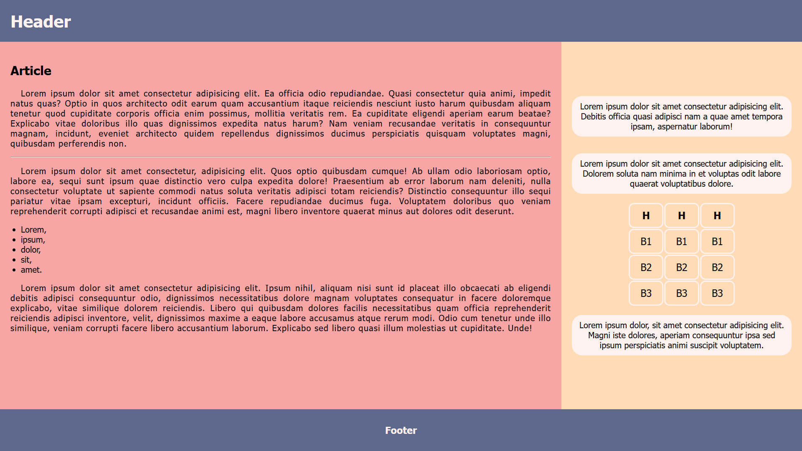
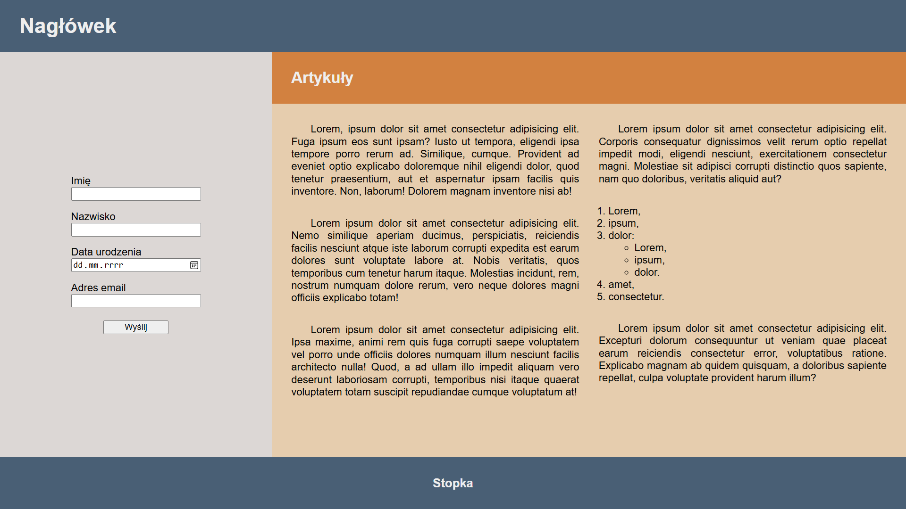
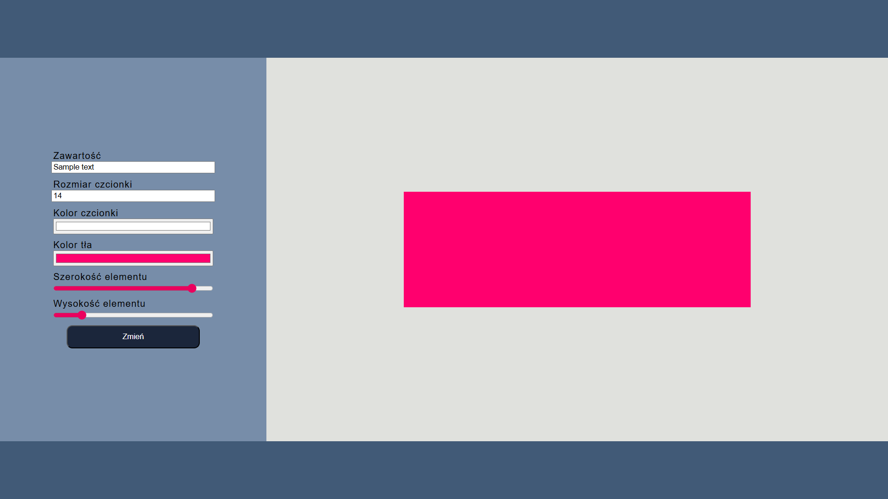
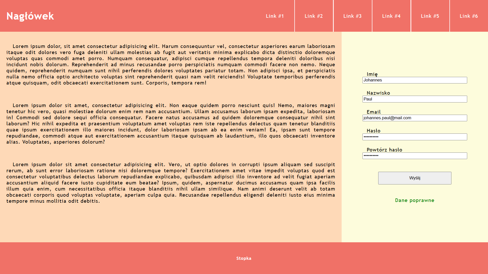
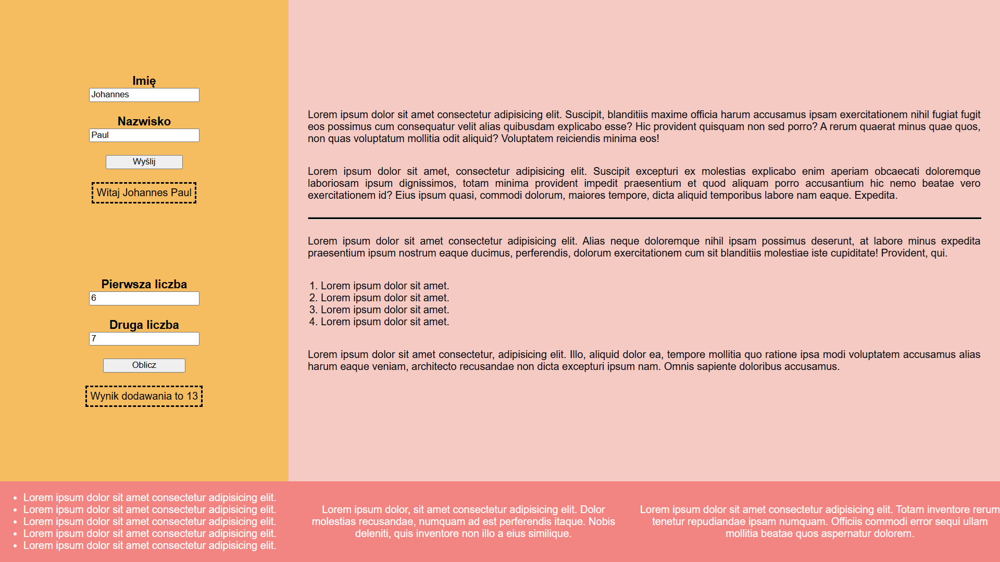
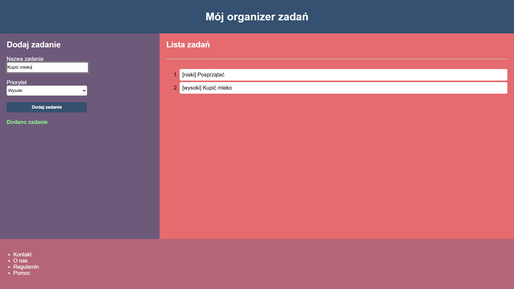

<a name = "wprowadzenie"></a>
# Wprowadzenie

Na początek należy odpowiednio przygotować strukturę HTML. Należy pamiętać o załączeniu skryptu przed końcem znacznika `body`.

```html
<form>
    <input type = "text" id = "pole">
    <button type = "button" id = "przycisk">Przycisk</button>
</form>

<p id = 'akapit'></p>

<script src = 'script.js'></script>
```

W *javascript* pobieramy wszystkie interesujące nas elementy, do których będziemy się chcieli później odwoływać.

```js
const pole = document.querySelector('#pole')
const przycisk = document.querySelector('#przycisk')
const akapit = document.querySelector('#akapit')
```

Następnie przygotowujemy funkcję, która ma zostać wywołana po naciśnięciu przycisku. Wewnątrz pobieramy wartości pól i ustalamy dalsze działanie.

```js
function poKliknieciu () {

    const wartosc = pole.value

    // Zarządzanie wartościami (wewnątrz funkcji)
}
```

Możemy dowolnie zarządzać własnościami danego elementu.

```js
    akapit.classList.add('nazwaKlasy') // Dodanie klasy
    akapit.classList.remove('nazwaKlasy') // Usunięcie klasy

    akapit.innerText = 'Nowa zawartość' // Wpisanie tekstu
    akapit.innerHTML = '<h1>Nowa zawartość</h1>' // Wpisanie struktury
    lista.innerHTML += '<li>Nowy podpunkt</li>' // Dopisanie struktury

    akapit.style.backgroundColor = 'red' // Zmiana stylu
```

Na koniec należy pamiętać o przypisaniu obsługi zdarzenia do przycisku.

```js
przycisk.addEventListener('click', poKliknieciu)
```

<a name = "projekty"></a>
# Projekty

## 1. Układanie i stylizowanie podstawowych elementów witryny #1

### Zawartość
* Witryna napisana w języku *HTML5*, w pliku o nazwie **index** z odpowiednim rozszerzeniem.
* Zadeklarowany język zawartości witryny - **angielski**.
* Tytuł strony widoczny na karcie przeglądarki - **Page**.
* Prawidłowo połączony zewnętrzny arkusz stylów.
* Witryna jest podzielona na *semantyczne elementy blokowe*.
* Strona składa się z *belki górnej* z *nagłówkiem*, *części głównej* oraz *belki dolnej* z *nagłówkiem*.
* *Część główna* podzielona jest na *artykuł* i *część poboczną*.
* W *artykule* znajduje się *nagłówek*, *akapit*, *pozioma linia*, *akapit*, pięcioelementowa *lista nienumerowana* i kolejny *akapit*.
* *Część poboczna* zawiera dwa *akapity*, *tabelę* o wymiarach *3 x 4* oraz kolejny *akapit*.

### Wygląd

* Strona powinna w jak największym stopniu przypominać załączoną grafikę.
* Style zdefiniowane w oddzielnym pliku CSS o nazwie **index** i odpowiednim rozszerzeniu.
* Zastosowane kolory:
  * `#5D688A`,
  * `#F7A5A5`,
  * `#FFDBB6`,
  * `#FFF2EF`.
* Krój czcionki: **Tahoma**.
* Należy zadbać o podstawową responsywność.

### Oczekiwany wygląd witryny



## 2. Układanie i stylizowanie podstawowych elementów witryny #2

### Zawartość
* Witryna napisana w języku *HTML5*, w pliku o nazwie **main** z odpowiednim rozszerzeniem.
* Zadeklarowany język zawartości witryny - **polski**.
* Tytuł strony widoczny na karcie przeglądarki - **Strona**.
* Prawidłowo połączony zewnętrzny arkusz stylów.
* Witryna jest podzielona na *semantyczne elementy blokowe*.
* Strona składa się z *belki górnej* z *nagłówkiem*, *części głównej* oraz *belki dolnej* z *nagłówkiem*.
* *Część główna* podzielona jest na *formularz* i *artykuł*.
* Formularz zawiera cztery *pola wprowadzania* o odpowiednim typie, poprzedzone prawidłowo połączonymi *etykietami*, oraz *przycisk*.
* W *artykule* znajduje się *nagłówek* i dwie *sekcje* podzielone na *akapity*.
* W jednej z *sekcji* znajduje się zagnieżdżona *lista*.

### Wygląd

* Strona powinna w jak największym stopniu przypominać załączoną grafikę.
* Style zdefiniowane w oddzielnym pliku CSS o nazwie **main** i odpowiednim rozszerzeniu.
* Zastosowane kolory:
  * `#495F75`,
  * `#D28140`,
  * `#E6CDAE`,
  * `#DCD7D5`.
* Krój czcionki: **Arial**.
* Należy zadbać o podstawową responsywność.

### Oczekiwany wygląd witryny



## 3. Podstawy obsługi formularza #1

### Zawartość
* Witryna napisana w języku *HTML5*, w pliku o nazwie **main** z odpowiednim rozszerzeniem.
* Zadeklarowany język zawartości witryny - **polski**.
* Tytuł strony widoczny na karcie przeglądarki - **Strona**.
* Prawidłowo połączony zewnętrzny arkusz stylów.
* Witryna jest podzielona na *semantyczne elementy blokowe*.

* Strona składa się z *belki górnej*, *części głównej* oraz *belki dolnej*.
* *Część główna* podzielona jest na *formularz* i *sekcję*.
* Formularz zawiera sześć *pól wprowadzania* o odpowiednim typie, poprzedzone prawidłowo połączonymi *etykietami*, oraz *przycisk*.
* W *sekcji* znajduje się *element blokowy*.

### Wygląd

* Strona powinna w jak największym stopniu przypominać załączoną grafikę.
* Style zdefiniowane w oddzielnym pliku CSS o nazwie **main** i odpowiednim rozszerzeniu.
* Zastosowane kolory:
  * `#1B263B`,
  * `#415A77`,
  * `#778DA9`,
  * `#E0E1DD`,
* Krój czcionki: **Helvetica**.
* Należy zadbać o podstawową responsywność.

### Działanie

Po naciśnięciu przycisku pobierane są wartości podane przez użytkownika - *zawartość*, *rozmiar* i *kolor czcionki*, *kolor tła* oraz *wymiary* elementu, a następnie przypisywane elementowi blokowemu.

### Oczekiwany wygląd witryny



## 4. Podstawy obsługi formularza #2

### Zawartość
* Witryna napisana w języku *HTML5*, w pliku o nazwie **index** z odpowiednim rozszerzeniem.
* Zadeklarowany język zawartości witryny - **polski**.
* Tytuł strony widoczny na karcie przeglądarki - **Strona**.
* Prawidłowo połączony zewnętrzny arkusz stylów.
* Witryna jest podzielona na *semantyczne elementy blokowe*.

* Strona składa się z *belki górnej*, *części głównej* oraz *belki dolnej*.
* *Belka górna* zawiera nagłówek pierwszego stopnia oraz nawigację z sześcioma odnośnikami.
* *Część główna* podzielona jest na *artykuł* *formularz*.
* W *artykule* znajdują się trzy *akapity*.
* Formularz zawiera pięć *pól wprowadzania* o odpowiednim typie, poprzedzone prawidłowo połączonymi *etykietami*, *przycisk* oraz *akapit*.

### Wygląd

* Strona powinna w jak największym stopniu przypominać załączoną grafikę.
* Style zdefiniowane w oddzielnym pliku CSS o nazwie **index** i odpowiednim rozszerzeniu.
* Zastosowane kolory:
  * `f07167`<sub>16</sub>,
  * `fed9b7`<sub>16</sub>,
  * `fdfcdc`<sub>16</sub>,
* Krój czcionki: **'Trebuchet MS'**.
* Należy zadbać o podstawową responsywność.

### Działanie

Po naciśnięciu przycisku pobierane są wartości podane przez użytkownika - *imię*, *nazwisko*, *adres email*, *hasło* oraz *powtórzone hasło*. Następnie wprowadzone dane są sprawdzane pod kątem poprawności. *Imię*, *nazwisko* i *email* powinny mieć przynajmniej trzy litery, *hasło* przynajmniej osiem, ponadto *hasła* powinny być takie same. W zależności czy dane są poprawne wpisz w akapit poniżej przycisku tekst ${\textsf{\color{green}Dane poprawne}}$ lub ${\textsf{\color{red}Dane niepoprawne}}$.

### Oczekiwany wygląd witryny



## 5. Zarządzanie danymi użytkownika

### Zawartość
* Witryna napisana w języku *HTML5*, w pliku o nazwie **index** z odpowiednim rozszerzeniem.
* Zadeklarowany język zawartości witryny - **polski**.
* Tytuł strony widoczny na karcie przeglądarki - **Strona**.
* Prawidłowo połączony zewnętrzny arkusz stylów.
* Witryna jest podzielona na *semantyczne elementy blokowe*.

* Strona składa się z *części głównej* oraz *belki dolnej*.
* *Część główna* podzielona jest na *część poboczną* oraz *artykuł*.
* W skład *części pobocznej* wchodzą dwa *formularze*, a w nich *etykiety*, *pola wprowadzania*, *przyciski* oraz *elementy liniowe*.
* W *artykule* znajdują się dwa *akapity*, *pozioma linia*, *akapit*, *czteroelementowa lista numerowana* i jeszcze jeden *akapit*.
* *Stopka* składa się z *pięcioelementowej listy nienumerowanej* i dwóch *akapitów*.

### Wygląd

* Strona powinna w jak największym stopniu przypominać załączoną grafikę.
* Style zdefiniowane w oddzielnym pliku CSS o nazwie **style** i odpowiednim rozszerzeniu.
* Zastosowane kolory:
  * `f5cac3`<sub>16</sub>,
  * `f28482`<sub>16</sub>,
  * `f6bd60`<sub>16</sub>,
* Krój czcionki: **'Arial'**.
* Należy zadbać o podstawową responsywność.

### Działanie

- Po naciśnięciu pierwszego przycisku z pól pobierane są *imię* oraz *nazwisko* użytkownika i wyświetlane poniżej przycisku.

- Po naciśnięciu drugiego przycisku z pól pobierane są *wartości liczbowe* podane przez użytkownika, a następnie ich *suma* pojawia się poniżej przycisku.

### Oczekiwany wygląd witryny



## 6. Organizer zadań

### Zawartość
* Witryna napisana w języku *HTML5*, w pliku o nazwie **index** z odpowiednim rozszerzeniem.
* Zadeklarowany język zawartości witryny - **polski**.
* Tytuł strony widoczny na karcie przeglądarki - **Mój organizer**.
* Prawidłowo połączony zewnętrzny arkusz stylów.
* Witryna jest podzielona na *semantyczne elementy blokowe*.

* Strona składa się z *belki górnej*, *części głównej* oraz *belki dolnej*.
* *Część główna* podzielona jest na *część poboczną* oraz *artykuł*.
* W skład *części pobocznej* wchodzą *nagłówek drugiego stopnia* i *formularz*, a w nich *etykiety*, *pole wprowadzania*, *lista wybierana*, *przycisk* oraz *element liniowy*.
* W *artykule* znajduje się *nagłówek drugiego rzędu*, *pozioma linia* i pusta *lista uporządkowana*.
* *Stopka* składa się z *czteroelementowej listy nienumerowanej*.

### Wygląd

* Strona powinna w jak największym stopniu przypominać załączoną grafikę.
* Style zdefiniowane w oddzielnym pliku CSS o nazwie **index** i odpowiednim rozszerzeniu.
* Zastosowane kolory:
  * `355070`<sub>16</sub>,
  * `6d597a`<sub>16</sub>,
  * `b56576`<sub>16</sub>,
  * `e56b6f`<sub>16</sub>,
* Krój czcionki: **'Arial'**.
* Należy zadbać o podstawową responsywność.
* Po najechaniu kursorem na przycisk, jego tło zmienia się na delikatnie ciemniejsze.

### Działanie

Po naciśnięciu pierwszego przycisku *Dodaj zadanie* pobierana jest *nazwa zadania* oraz *priorytet*. Jeżeli pole jest puste, w elemencie liniowym poniżej formularza, wypisujemy komunikat ${\textsf{\color{red}Wpisz nazwę zadania!}}$. W przeciwnym wypadku wypisujemy ${\textsf{\color{green}Dodano zadanie}}$, a do listy w artykule dopisywany jest element `<li>` o zawartości w formacie:

<p align = "center">[Priorytet] Nazwa zadania.</p>

Dostępne priorytety to **niski**, **średni** i **wysoki**.

### Oczekiwany wygląd witryny



## 7. Panel zarządzania kontaktami (*)

Witryna internetowa służąca do zarządzania listą kontaktów użytkownika. Umożliwia dodawanie nowych osób wraz z ich danymi, takich jak *numer telefonu*, *adres email* oraz przypisana *grupa*.

### Zawartość

* Witryna napisana w języku *HTML5*, w pliku o nazwie **index** z odpowiednim rozszerzeniem.
* Zadeklarowany język zawartości witryny - **polski**.
* Tytuł strony widoczny na karcie przeglądarki - **Moje kontakty**.
* Prawidłowo połączony zewnętrzny arkusz stylów i skrypt.
* Witryna jest podzielona na *semantyczne elementy blokowe*.

	#### Struktura

	- Strona składa się z belki górnej, części głównej oraz belki dolnej.
	- Belka górna zawiera nagłówek pierwszego poziomu - *Książka kontaktowa* oraz przykładową grafikę związaną z tematyką strony.
	- Część główna podzielona jest na artykuł i część poboczną.
	- Artykuł ma w sobie:

		- nagłówek drugiego stopnia - *Lista kontaktów*,
		- poziomą linię,
		- sekcję zawierającą listę nienumerowaną kontaktów (*początkowo pustą*).

	- Część poboczna zawiera:
		- nagłówek drugiego stopnia - *Dodaj kontakt,
		- formularz, a w nim:
			- (*imię*) etykieta, pole wprowadzania o odpowiednim typie oraz pusty element liniowy,
			- (*nazwisko*) etykieta, pole wprowadzania o odpowiednim typie oraz pusty element liniowy,
			- (*numer telefonu*) etykieta, pole wprowadzania o odpowiednim typie oraz pusty element liniowy,
			- (*email*) etykieta, pole wprowadzania o odpowiednim typie oraz pusty element liniowy,
			- (*grupa*) etykieta, lista wybierania z przykładowymi opcjami (na przykład *znajomi*, *praca*, *rodzina*) oraz element liniowy,
			- Przycisk - *Dodaj kontakt*, pusty element liniowy.

	- Na stopkę składa się lista numerowana z czterema elementami (dane autora - *imię*, *nazwisko*, *klasa* i *przykładowy PESEL*)

### Wygląd

- Strona powinna w jak największym stopniu przypominać nowoczesny panel.
- Style zdefiniowane w oddzielnym pliku *CSS* o nazwie **index** i odpowiednim rozszerzeniu.
- Krój czcionki: **'Helvetica'**.
- Należy zadbać o podstawową responsywność, korzystając z **flexbox**.
- Dany kontakt po najechaniu na niego kursorem zostaje wyróżniony (*na przykład inny kolor tła i tekstu*).

### Działanie

- #### Pobieranie wartości

	Po naciśnięciu przycisku **Dodaj kontakt** pobierane są wartości pól formularza:
	- *imię*,
	- *nazwisko*,
	- *numer telefonu*,
	- *email*,
	- *grupa*.

- #### Walidacja danych

	Jeżeli:
	- pole *imię* jest puste wyświetl komunikat: ${\textsf{\color{red}Wpisz imię!}}$,
	- pole *nazwisko* jest puste wyświetl komunikat: ${\textsf{\color{red}Wpisz nazwisko!}}$,
	- pole *numer telefonu* jest puste wyświetl komunikat: ${\textsf{\color{red}Wpisz numer telefonu!}}$,
	- *numer telefonu* jest krótszy niż *9* znaków wyświetl komunikat: ${\textsf{\color{red}Wpisz prawidłowy numer telefonu!}}$,
	- *email* nie zawiera znaku `@` wyświetl komunikat: ${\textsf{\color{red}Wpisz prawidłowy adres email!}}$,
		<details>
			<summary>Podpowiedź</summary>
			Skorzystaj z metody value.includes('@')`, gdzie `value` oznacza wartość pola.
		</details>
	- wszystkie dane są prawidłowe wyświetl komunikat pod przyciskiem: ${\textsf{\color{green}Dodano kontakt!}}$.

	Komunikaty powinny zostać wyświetlone w elementach liniowych pod odpowiednimi polami wprowadzania. W przypadku sukcesu wszelkie komunikaty błędu są usuwane.

- #### Wyświetlanie listy kontaktów

	Jeżeli dane pomyślnie przeszły walidację, do listy dodawany jest element `<li>`, o zawartości w formacie:

	`<Imię> <Nazwisko> | <Telefon> | <Email> | <Grupa>`.
